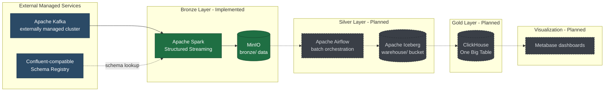
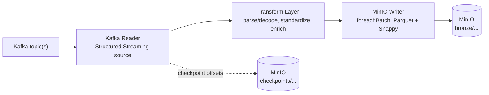
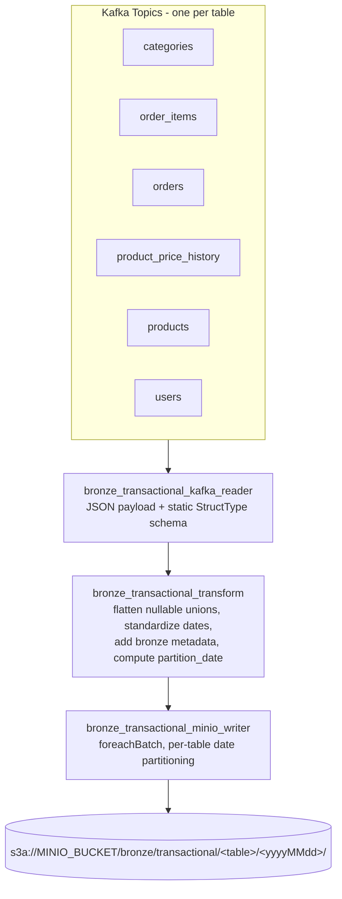
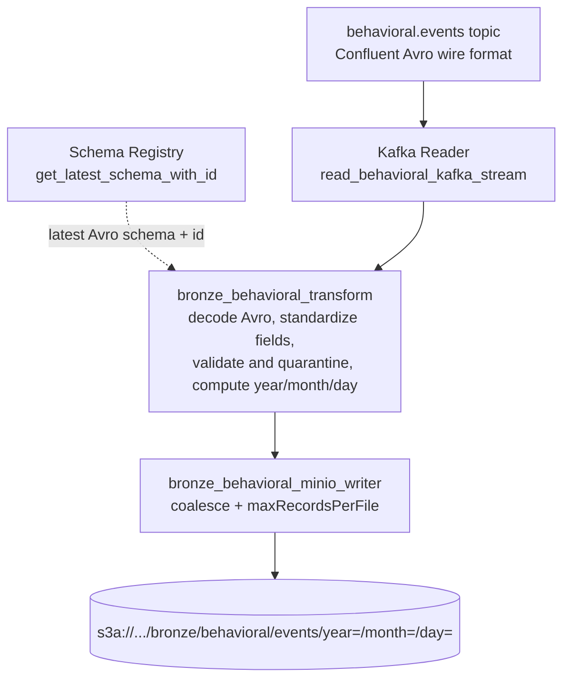

# Modern Data Analytics Platform

A Kafka-to-Lakehouse data platform built on Apache Spark, MinIO, and a Confluent-compatible Schema Registry, orchestrated locally and on VPS via Docker Compose.

The platform follows a Medallion (Bronze / Silver / Gold) architecture. **This repository currently implements the Bronze layer.** Silver, Gold, and orchestration are provisioned at the infrastructure level but not yet implemented in code.

---

## Table of Contents

1. [Project Overview](#1-project-overview)
2. [Architecture Overview](#2-architecture-overview)
3. [Bronze Layer](#3-bronze-layer)
4. [Transactional Pipeline](#4-transactional-pipeline)
5. [Behavioral Pipeline](#5-behavioral-pipeline)
6. [Component Responsibilities](#6-component-responsibilities)
7. [Repository Structure](#7-repository-structure)
8. [Technology Stack](#8-technology-stack)
9. [Configuration Management](#9-configuration-management)
10. [Development Setup](#10-development-setup)
11. [Current Implementation Status](#11-current-implementation-status)
12. [Git Workflow](#12-git-workflow)
13. [Engineering Notes](#13-engineering-notes)

---

## 1. Project Overview

### Problem Statement

E-commerce systems produce two structurally different data streams: **transactional data** (orders, users, products, pricing) from operational systems, and **behavioral data** (clickstream, cart activity, search, page views) from user interaction tracking. Both need to land in a lake reliably, with schema enforcement and full lineage, before they can be cleaned, modeled, and served for analytics.

This platform ingests both streams from Kafka into a MinIO-backed Bronze layer using Apache Spark Structured Streaming, as the ingestion foundation for a downstream Silver (Iceberg, Kimball modeling) and Gold (ClickHouse OLAP) layer.

### Current Scope

- Two independent Bronze ingestion pipelines: **Transactional** and **Behavioral**.
- Local/VPS infrastructure for the full target stack (Spark, MinIO, Airflow, Iceberg REST catalog, ClickHouse, Metabase) via Docker Compose.
- Kafka and the Schema Registry are treated as externally managed dependencies, not started by this repository.

### Current Maturity Level

Early-stage, active development. The Bronze layer's ingestion, transformation, and write logic is implemented per pipeline. Orchestration (Airflow DAGs), Silver modeling, Gold loading, and BI dashboards are not yet implemented — see [Section 11](#11-current-implementation-status) for a precise breakdown, and [Section 13](#13-engineering-notes) for known wiring issues that should be resolved before running the jobs end-to-end.

---

## 2. Architecture Overview

Kafka and the Schema Registry are external systems the platform connects to but does not provision. Everything from Spark onward is provisioned by this repository's Docker Compose stack. Silver, Gold, orchestration, and visualization services are already defined in `docker-compose.yml` (infrastructure-first), but have no corresponding pipeline code yet.



Solid nodes/edges are implemented today. Dashed nodes/edges represent infrastructure that is already provisioned in `docker-compose.yml` (Airflow, Iceberg REST catalog, ClickHouse, Metabase) but has no pipeline code writing to or reading from it yet.

---

## 3. Bronze Layer

### Purpose

Land raw events from Kafka into MinIO as Parquet, with minimal, well-defined transformations: schema parsing/decoding, basic standardization, lineage metadata, and partitioning. The Bronze layer intentionally does not deduplicate, join, or model data — that is Silver's responsibility.

### Responsibilities

- Consume Kafka topics via Spark Structured Streaming.
- Parse or decode the wire format (JSON for Transactional, Confluent Avro for Behavioral) against a known schema.
- Attach ingestion lineage metadata (source table/topic, ingestion timestamp, and — for Behavioral — schema id).
- Partition output by date for efficient downstream reads.
- Write append-only, Snappy-compressed Parquet to MinIO with streaming checkpoints for exactly-once micro-batch semantics.

### Data Flow (shared pattern)

Both pipelines follow the same four-stage shape, implemented independently per pipeline:



---

## 4. Transactional Pipeline

### Purpose

Ingest six core e-commerce entities from Kafka, one topic per table, using statically defined schemas.

### Components

| Module | File |
|---|---|
| Kafka Reader | `src/common/bronze_transactional_kafka_reader.py` |
| Transform | `src/common/bronze_transactional_transform.py` |
| Spark Session | `src/common/bronze_transactional_spark_session.py` |
| MinIO Writer | `src/common/bronze_transactional_minio_writer.py` |
| Schemas | `src/schemas/bronze_transactional_schemas.py` |
| Job Entrypoint | `src/jobs/bronze_transactional_job.py` |

### Tables and Partition Source

Each table is read from its own Kafka topic and parsed against a static PySpark `StructType`. Because not every topic carries a business timestamp, the partition date is derived per table:

| Table | Partition Source Column | Nullable Union Fields Flattened |
|---|---|---|
| `orders` | `event_timestamp` (from `timestamp`) | `payment_method` |
| `product_price_history` | `valid_from_timestamp` (from `valid_from`) | — |
| `users` | `signup_date` | `loyalty_tier`, `location` |
| `categories` | `_kafka_timestamp` (fallback) | `parent_category_id` |
| `order_items` | `_kafka_timestamp` (fallback) | — |
| `products` | `_kafka_timestamp` (fallback) | — |

"Nullable union fields" are Avro-style `{"string": "value"}` wrapper objects flattened into plain nullable string columns.

### Flow



One streaming query is started per table; the job awaits termination of any query and stops all queries cleanly on shutdown or failure.

---

## 5. Behavioral Pipeline

### Purpose

Ingest a single clickstream/behavioral events topic (`behavioral.events`) encoded in Confluent Avro wire format, with the schema resolved dynamically from a Schema Registry rather than hardcoded.

### Components

| Module | File |
|---|---|
| Kafka Reader | `src/common/bronze_behavioral_kafka_reader.py` |
| Transform | `src/common/bronze_behavioral_transform.py` |
| Spark Session | `src/common/bronze_behavioral_spark_session.py` |
| MinIO Writer | `src/common/bronze_behavioral_minio_writer.py` |
| Registry Client | `src/common/registry_client.py` |
| Schema Metadata | `src/schemas/bronze_behavioral_schemas.py` |
| Job Entrypoint | `src/jobs/bronze_behavioral_job.py` |

### Design Highlights

- **Confluent wire-format decoding**: each Kafka message is decoded by stripping the magic byte and 4-byte schema id before Avro-decoding the payload (`PERMISSIVE` mode).
- **Quarantine, not drop**: records that fail to decode, or whose wire-format schema id doesn't match the schema fetched from the registry, are **kept** with `decode_success`, `schema_id_matches`, `decode_error`, `validation_errors`, and `is_valid` columns populated, so Silver can route them to quarantine instead of the stream failing.
- **Partition fallback**: `year`/`month`/`day` are derived from `event_timestamp` when it parses correctly, falling back to the Kafka broker's own timestamp so records never land in a null partition.

### Flow



> The `read_behavioral_kafka_stream` function is referenced by the job entrypoint but is not yet implemented in `bronze_behavioral_kafka_reader.py` — see [Section 13](#13-engineering-notes).

---

## 6. Component Responsibilities

**Kafka Readers** open a Structured Streaming source against one or more topics and hand back a raw or parsed DataFrame. The Transactional reader (`read_kafka_topic` / `read_and_parse_kafka_topic`) is fully implemented: configurable bootstrap servers, configurable starting offsets (default `earliest`), `failOnDataLoss=false`, and retains Kafka metadata columns (`_kafka_topic`, `_kafka_partition`, `_kafka_offset`, `_kafka_timestamp`).

**Spark Jobs** (`src/jobs/`) are the orchestration entrypoints. Each wires reader → transform → writer for its pipeline, starts the streaming quer(y/ies), and awaits termination. The Transactional job starts one query per table and stops all of them cleanly on shutdown or failure; the Behavioral job resolves the Avro schema from the registry before starting its single query.

**Transform Layer** applies the Bronze-appropriate minimum: schema parsing/decoding, targeted field standardization, lineage metadata, and partition-column computation. It does not deduplicate, join, or model — see [Section 3](#3-bronze-layer).

**Registry Client** (`src/common/registry_client.py`) fetches the latest Avro schema, and optionally its numeric schema id, for a subject from a Confluent-compatible Schema Registry over HTTP. It is written generically (subject-parameterized, no Behavioral-specific naming) so it can be reused by future Avro-backed pipelines.

**MinIO Writers** persist each micro-batch as Snappy-compressed Parquet via `foreachBatch`, with a checkpoint location for streaming fault tolerance. The Behavioral writer additionally coalesces each micro-batch to a small, fixed number of output files and caps file size via `maxRecordsPerFile`, to counter small-file proliferation at low throughput — both tunable via environment variables.

**Schema Definitions** take two different, deliberate forms: Transactional schemas are static PySpark `StructType`s checked into `src/schemas/bronze_transactional_schemas.py`, since those topics are internally defined. Behavioral schema metadata (`src/schemas/bronze_behavioral_schemas.py`) explicitly does **not** contain a copy of the Avro schema — the module's own docstring states the Schema Registry is the single source of truth, and only column-contract constants live in the repository.

---

## 7. Repository Structure

```
modern_data_analytics_platform/
├── docker-compose.yml           # Full target infrastructure stack
├── .env.example                 # Secrets template (see Section 9)
├── .gitignore
├── README.md
│
├── docs/
│   ├── DESIGN.fa.md              # Infrastructure design rationale (Persian)
│   ├── DEVELOPMENT.md            # Phased build guide (Bronze -> Gold -> Viz)
│   ├── DEPLOYMENT.md             # VPS deployment guide
│   └── TRAEFIK.fa.md             # Reverse-proxy / domain routing (Persian)
│
├── src/
│   ├── common/
│   │   ├── bronze_transactional_kafka_reader.py
│   │   ├── bronze_transactional_minio_writer.py
│   │   ├── bronze_transactional_spark_session.py
│   │   ├── bronze_transactional_transform.py
│   │   ├── bronze_behavioral_kafka_reader.py
│   │   ├── bronze_behavioral_minio_writer.py
│   │   ├── bronze_behavioral_spark_session.py
│   │   ├── bronze_behavioral_transform.py
│   │   └── registry_client.py
│   │
│   ├── jobs/
│   │   ├── bronze_transactional_job.py
│   │   └── bronze_behavioral_job.py
│   │
│   └── schemas/
│       ├── bronze_transactional_schemas.py
│       └── bronze_behavioral_schemas.py
│
├── workflow/                    # Airflow scaffold (Silver phase) - not yet populated
│   ├── dags/
│   ├── tasks/
│   └── utils/
│
├── sql/                         # Gold/Silver SQL scaffold - not yet populated
│   ├── clickhouse/
│   ├── iceberg/
│   └── metabase/
│
└── configs/                     # Per-service config mounts - not yet populated
    ├── airflow/
    ├── clickhouse/
    ├── metabase/
    ├── minio/
    └── spark/
```

`workflow/`, `sql/`, and `configs/` currently contain only placeholder files preserving the directory structure for later phases; there is no Silver/Gold/orchestration code yet.

---

## 8. Technology Stack

| Category | Technology | Status |
|---|---|---|
| Streaming ingestion | Apache Kafka | External, not provisioned by this repository |
| Schema management | Confluent-compatible Schema Registry | External; consumed by the Behavioral pipeline |
| Stream processing | Apache Spark 3.5.3 (Structured Streaming) | Implemented |
| Spark packages (Behavioral) | `spark-sql-kafka-0-10_2.12:3.5.3`, `spark-avro_2.12:3.5.3`, `hadoop-aws:3.3.4` | Implemented |
| Object storage | MinIO (S3-compatible), Parquet + Snappy | Implemented |
| Language / runtime | Python (PySpark) | Implemented |
| Local/VPS infrastructure | Docker Compose | Implemented |
| Orchestration | Apache Airflow 3.2.1 (CeleryExecutor, Postgres backend, Redis broker) | Provisioned, not yet integrated |
| Table format | Apache Iceberg via REST Catalog 1.6.0 | Provisioned, not yet integrated |
| OLAP engine | ClickHouse 24.8 | Provisioned, not yet integrated |
| BI / visualization | Metabase v0.51.4 | Provisioned, not yet integrated |
| Reverse proxy | Traefik (external network) | Provisioned for VPS deployment |

---

## 9. Configuration Management

All configuration is environment-variable driven. No secrets or endpoints are hardcoded in application code; required variables are validated with a fail-fast `get_required_env()` helper that raises immediately if a value is missing or blank, rather than silently defaulting.

### Transactional Pipeline

| Variable | Required | Default | Used By |
|---|---|---|---|
| `KAFKA_BOOTSTRAP_SERVERS` | Yes | — | Kafka Reader |
| `KAFKA_STARTING_OFFSETS` | No | `earliest` | Kafka Reader |
| `MINIO_BUCKET` | Yes | — | MinIO Writer |
| `BRONZE_TRIGGER_INTERVAL` | No | `1 minute` | MinIO Writer |
| `SPARK_MASTER_URL` | No | `spark://spark-master:7077` | Spark Session |
| `MINIO_ENDPOINT` | No | `http://minio:9000` | Spark Session |
| `MINIO_ROOT_USER` | Yes | — | Spark Session |
| `MINIO_ROOT_PASSWORD` | Yes | — | Spark Session |
| `SPARK_LOG_LEVEL` | No | `WARN` | Spark Session |

### Behavioral Pipeline

| Variable | Required | Default | Used By |
|---|---|---|---|
| `SCHEMA_REGISTRY_URL` | Yes | — | Registry Client |
| `SCHEMA_REGISTRY_TIMEOUT` | No | `10` (seconds) | Registry Client |
| `BEHAVIORAL_SCHEMA_SUBJECT` | No | `behavioral.events-value` | Job |
| `BRONZE_BASE_PATH` | No | `s3a://bronze` | Job |
| `BEHAVIORAL_BRONZE_OUTPUT_PATH` | No | `{BRONZE_BASE_PATH}/behavioral/events` | Job |
| `CHECKPOINT_BASE_PATH` | No | `s3a://checkpoints/bronze` | Job |
| `BEHAVIORAL_BRONZE_CHECKPOINT_PATH` | No | `{CHECKPOINT_BASE_PATH}/behavioral/events` | Job |
| `BEHAVIORAL_TRIGGER_INTERVAL` | No | `30 seconds` | Job |
| `SPARK_MASTER_URL` | No | `spark://spark-master:7077` | Spark Session |
| `MINIO_ENDPOINT` | No | `http://minio:9000` | Spark Session |
| `MINIO_ACCESS_KEY` (falls back to `MINIO_ROOT_USER`) | Yes (one of) | — | Spark Session |
| `MINIO_SECRET_KEY` (falls back to `MINIO_ROOT_PASSWORD`) | Yes (one of) | — | Spark Session |
| `SPARK_PACKAGES` | No | see [Section 8](#8-technology-stack) | Spark Session |
| `SPARK_SQL_SHUFFLE_PARTITIONS` | No | `4` | Spark Session |
| `SPARK_LOG_LEVEL` | No | `WARN` | Spark Session |
| `BRONZE_WRITE_COALESCE_PARTITIONS` | No | `2` | MinIO Writer |
| `BRONZE_WRITE_MAX_RECORDS_PER_FILE` | No | `500000` | MinIO Writer |

> The two pipelines resolve their MinIO output location differently: Transactional requires an explicit `MINIO_BUCKET`; Behavioral defaults to a bucket literally named `bronze` unless overridden. Keep this in mind when provisioning buckets — see [Section 13](#13-engineering-notes).

### Docker Compose / Infrastructure Secrets (`.env`)

Topology (ports, image versions, hostnames, Kafka address) lives in `docker-compose.yml`; `.env` holds only credentials, matching `.env.example`:

| Variable | Purpose |
|---|---|
| `AIRFLOW_FERNET_KEY`, `AIRFLOW_JWT_SECRET` | Airflow internal secrets |
| `AIRFLOW_ADMIN_USER`, `AIRFLOW_ADMIN_PASSWORD` | Airflow UI login |
| `POSTGRES_USER`, `POSTGRES_PASSWORD` | Airflow metadata database |
| `MINIO_ROOT_USER`, `MINIO_ROOT_PASSWORD` | Object storage credentials |
| `CLICKHOUSE_USER`, `CLICKHOUSE_PASSWORD` | Gold-layer database |
| `METABASE_DB_USER`, `METABASE_DB_PASSWORD` | Metabase metadata database |

`.env` is git-ignored; only `.env.example` (with placeholder values) is committed.

---

## 10. Development Setup

### 1. Clone and configure

```bash
git clone <repository-url>
cd modern_data_analytics_platform
cp .env.example .env
# edit .env with real credentials
```

### 2. Start local infrastructure

```bash
docker compose up -d
docker compose ps
```

This brings up Postgres, Redis, Airflow, Spark (master + worker), MinIO, the Iceberg REST catalog, ClickHouse, and Metabase. Kafka is **not** part of this stack — confirm reachability separately:

```bash
nc -zv <KAFKA_HOST> 9092
```

### 3. Create MinIO buckets

Buckets are not created automatically. For the Bronze phase, create `bronze` and `checkpoints` via the MinIO Console (`http://localhost:9001`) or the `mc` CLI, for example:

```bash
docker run --rm --network modern_data_analytics_platform_datalake \
  -e MINIO_ROOT_USER=<user> \
  -e MINIO_ROOT_PASSWORD=<password> \
  minio/mc sh -c '
    mc alias set local http://minio:9000 "$MINIO_ROOT_USER" "$MINIO_ROOT_PASSWORD" &&
    mc mb --ignore-existing local/bronze local/checkpoints &&
    mc ls local
  '
```

### 4. Run a Bronze job

`src/` is mounted into the Spark containers at `/opt/spark-apps`. Jobs are run with `spark-submit` inside `spark-master`:

```bash
docker compose exec spark-master /opt/spark/bin/spark-submit \
  --master spark://spark-master:7077 \
  --packages org.apache.spark:spark-sql-kafka-0-10_2.12:3.5.3,org.apache.spark:spark-avro_2.12:3.5.3,org.apache.hadoop:hadoop-aws:3.3.4 \
  /opt/spark-apps/jobs/bronze_transactional_job.py
```

```bash
docker compose exec spark-master /opt/spark/bin/spark-submit \
  --master spark://spark-master:7077 \
  --packages org.apache.spark:spark-sql-kafka-0-10_2.12:3.5.3,org.apache.spark:spark-avro_2.12:3.5.3,org.apache.hadoop:hadoop-aws:3.3.4 \
  /opt/spark-apps/jobs/bronze_behavioral_job.py
```

> Both job entrypoints currently have import-path inconsistencies that must be resolved before they will run successfully — see [Section 13](#13-engineering-notes).

For VPS deployment, firewall rules, and reverse-proxy/domain configuration, see `docs/DEPLOYMENT.md` and `docs/TRAEFIK.fa.md`.

---

## 11. Current Implementation Status

**Implemented**
- Bronze Transactional ingestion for six tables (`categories`, `order_items`, `orders`, `product_price_history`, `products`, `users`) with static schema-on-read and per-table date partitioning.
- Bronze Behavioral ingestion with Confluent Avro decoding, live Schema Registry lookup, and a quarantine-not-drop validation pattern.
- Kafka Structured Streaming integration (Transactional reader).
- Per-pipeline Spark session bootstrapping, including MinIO/S3A configuration.
- MinIO/S3A Parquet writers with checkpointing, small-file mitigation on the Behavioral side.
- Schema Registry client, written for reuse across future Avro-backed pipelines.
- Environment-based configuration with fail-fast validation of required variables.
- Base infrastructure via Docker Compose: Postgres, Redis, Airflow (5 services), Spark, MinIO, Iceberg REST catalog, ClickHouse, Metabase, Traefik labels for VPS routing.

**In Progress**
- Reconciling import paths and package structure across `src/jobs/` and `src/common/`/`src/schemas/` (see [Section 13](#13-engineering-notes)).
- Implementing the Behavioral Kafka reader (`read_behavioral_kafka_stream`).
- Automated MinIO bucket provisioning (currently a manual, per-phase step).
- Testing (no test suite currently exists).
- Data quality checks beyond Bronze-level decode/field validation.
- Monitoring and observability.

**Future**
- Silver layer: Iceberg tables via the REST catalog, data cleansing, Kimball star schema (`dim_user`, `dim_product`, `dim_date` with SCD Type 2, `fact_order`, `fact_behavioral_events`).
- Gold layer: denormalized One Big Table in ClickHouse for OLAP.
- Airflow DAG orchestration for Silver/Gold batch ETL.
- Metabase dashboards (conversion funnel, behavior funnel, revenue/discount metrics, cohort analysis).
- Near-real-time pipeline monitoring (Kafka-based alerting DAG).
- Data lineage tooling.
- CI/CD.
- Docker Compose profiles to start only the services needed per phase, instead of the full stack.

---

## 12. Git Workflow

Development follows a feature-branch workflow aligned to the project's phased build order (see `docs/DEVELOPMENT.md`):

- `main` tracks stable, working infrastructure and pipeline code.
- Work happens on phase-scoped feature branches, e.g. `feature/bronze-streaming`, `feature/silver-iceberg`, `feature/gold-clickhouse`.
- Branches are merged into `main` once the corresponding phase's verification checklist passes (see the relevant phase in `docs/DEVELOPMENT.md`).
- `.env` is never committed; only `.env.example` is tracked.
- Prefer small, phase-scoped pull requests over broad cross-layer changes, so infrastructure, Bronze, Silver, and Gold changes remain independently reviewable.

---

## 13. Engineering Notes

**Kafka and Schema Registry are external by design.** Both are treated as managed dependencies the platform connects to, not services it owns — Spark and Airflow only need the bootstrap servers/registry URL. This keeps the Compose stack's resource footprint down and avoids duplicating infrastructure the platform doesn't control.

**Two schema strategies, deliberately.** Transactional schemas are static and checked into the repository because those topics are internally defined and stable. Behavioral schemas are always fetched live from the Schema Registry — the schema module's docstring explicitly forbids checking in a copy — because the registry is the source of truth for that contract.

**Quarantine, not drop, for Behavioral data quality.** Records that fail Avro decoding or whose wire schema id doesn't match the registry's are kept with validation metadata rather than discarded, so bad data is diagnosable and Silver decides how to handle it, rather than the Bronze job failing or silently losing records.

**Small-file mitigation is opt-in per writer.** The Behavioral writer coalesces each micro-batch and caps file size (`BRONZE_WRITE_COALESCE_PARTITIONS`, `BRONZE_WRITE_MAX_RECORDS_PER_FILE`); the Transactional writer does not yet apply the same treatment.

**Infrastructure is provisioned ahead of code.** `docker-compose.yml` already defines Airflow, the Iceberg REST catalog, ClickHouse, and Metabase, even though no Silver/Gold code exists yet. This is a deliberate infrastructure-first sequencing choice from the project's phased build plan (`docs/DEVELOPMENT.md`), not scope creep — each phase's services are meant to be available before that phase's code is written.

**Known limitations to resolve before running the jobs:**
- `src/jobs/bronze_transactional_job.py` imports from module paths (`common.kafka_reader`, `common.minio_writer`, `common.spark_session`, `schema.transactional_schemas`, `transformations.bronze_transform_transactional`) that do not match the current `src/common/` and `src/schemas/` layout.
- `src/common/bronze_behavioral_kafka_reader.py` does not currently define `read_behavioral_kafka_stream`, which `src/jobs/bronze_behavioral_job.py` imports.
- The Behavioral job sets its own `src/` directory on `sys.path`; the Transactional job does not, so it currently depends on how it's invoked (e.g. `--py-files`, or a working directory under `src/`) to resolve its `common`/`schemas` imports.
- The Transactional and Behavioral pipelines default to different MinIO bucket conventions (explicit `MINIO_BUCKET` vs. a hardcoded `bronze` default) — worth aligning before Phase 2 (Silver) reads from both.
- There is no `requirements.txt` / dependency manifest for the pipeline code yet; dependencies are currently implied by the Spark image and the `--packages` list in [Section 8](#8-technology-stack).
