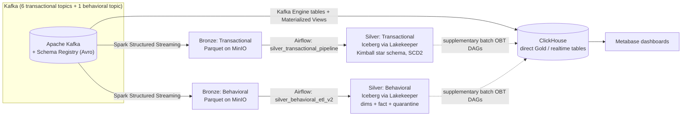

# Modern Data Analytics Platform

An end-to-end data engineering platform that ingests transactional and behavioral e-commerce data from Kafka, lands it in a governed Iceberg lakehouse (Bronze → Silver), and simultaneously serves near-real-time analytics through a direct Kafka-to-ClickHouse path, with Metabase dashboards on top.

> **Team Project — Quera Data Engineering Bootcamp.** Built by a 6-person team (Ali Khorasani, Rojin Ramin, Zahra Arjmand, Amir Golparvar, Reza Mirmaroof, Hossein Kashefi) as the second capstone project of the program. This README documents the platform as a whole; see [My Contributions](#my-contributions) for what I personally built.

## Project Overview

The platform's architectural goal is to handle two structurally different data domains — transactional records (orders, users, products, pricing) and behavioral clickstream events — with a **medallion architecture** (Bronze → Silver → Gold) for governed, replayable modeling, while *also* serving low-latency analytics through a second path that streams Kafka directly into ClickHouse, so dashboards aren't blocked on the daily batch schedule. This dual-path design is the platform's central engineering decision: correctness and replayability in the lakehouse, freshness in the direct-serving path.

## Architecture



Solid arrows are the primary paths; dashed arrows are supplementary batch jobs that reconcile Silver into ClickHouse OBT tables (documented in the codebase as secondary to the direct stream, not the primary Gold path).

## Data Flow

**Transactional (batch-modeled, streaming-ingested):** 6 Kafka topics (`categories`, `products`, `users`, `orders`, `order_items`, `product_price_history`) → Spark Structured Streaming Bronze consumer → partitioned Parquet on MinIO (`s3a://bronze/transactional/<table>/<yyyyMMdd>`) → daily Airflow-orchestrated Spark batch job → validated, deduplicated, Kimball-modeled Iceberg tables (dimensions + facts) via the Lakekeeper REST catalog.

**Behavioral (event-modeled, streaming-ingested):** 1 Kafka topic (`behavioral.events`, Confluent Avro envelope) → Spark Structured Streaming Bronze consumer → date-partitioned Parquet on MinIO → Airflow-orchestrated Spark batch job → validated/classified/deduplicated events, device and session dimensions, a stable event fact table, and a quarantine table for rejected records — all in Iceberg.

**Direct analytical serving (streaming, independent of the batch schedule):** the same Kafka topics are consumed a second time by ClickHouse Kafka Engine tables, transformed by Materialized Views (type casting, validity flagging), and written to MergeTree tables that Metabase queries directly. This path does not depend on the Silver pipeline completing.

## Data Architecture

- **Storage formats:** Parquet for Bronze; Apache Iceberg (format v2, Zstandard compression) for Silver.
- **Partitioning:** transactional Bronze by `yyyyMMdd`; behavioral Bronze by Hive-style `year=/month=/day=`; Silver partitioning is table-specific (day/month/bucket transforms managed by Iceberg).
- **Schema management:** Confluent Schema Registry with Avro for both domains; Spark enforces static `StructType` schemas on read; nullable Avro unions are flattened during Bronze standardization.
- **Data quality:** each Silver job separates records into valid / repaired / warning / rejected categories, with a dedicated `*_validation_issues` quality table per domain (source, error/warning arrays, lineage, detection timestamp).
- **Historical modeling:** SCD Type 2 on `dim_product_price_scd`, with `valid_from`/`valid_to` derived via window functions and an "unknown price" record for facts that can't resolve an interval.
- **Idempotency:** deterministic SHA-256-derived surrogate keys (e.g. `USR_`, `CAT_`, `PRD_`, `PPR_` prefixes) plus Iceberg `MERGE` so reprocessing a date doesn't duplicate rows.
- **Checkpointing:** each transactional entity and the behavioral stream write to isolated checkpoint paths in MinIO (`s3a://tr-checkpoints/...`, `s3a://be-checkpoints/...`), so one entity's failure doesn't affect another's recovery.
- **Quarantine/error handling:** rejected behavioral events are retained (not dropped) in `behavioral_events_quarantine` with raw payload, errors, and lineage for later repair/replay; rejected transactional records are recorded in the quality-issues table and excluded from facts.

## Technologies

| Category | Technologies | Role |
|---|---|---|
| Streaming | Apache Kafka, Confluent Schema Registry | Source event backbone, Avro schema governance |
| Processing | Apache Spark 3.5 (Structured Streaming + batch) | Bronze ingestion, Silver transformation/modeling |
| Orchestration | Apache Airflow 3.2 | Schedules and retries the daily Silver batch DAGs |
| Object Storage | MinIO (S3-compatible) | Bronze Parquet, Silver warehouse, streaming checkpoints |
| Lakehouse | Apache Iceberg, Lakekeeper (REST catalog) | ACID table format and catalog for Silver |
| Analytical DB | ClickHouse | Direct Kafka-fed serving layer (Kafka Engine → Materialized Views → MergeTree) |
| Metadata Stores | PostgreSQL (×3: Airflow, Lakekeeper, Metabase), Redis | Airflow metadata/broker, catalog metadata, BI metadata |
| BI | Metabase | Dashboards and ad-hoc SQL over ClickHouse |
| Infrastructure | Docker Compose, Traefik | Local/VPS service topology and routing |
| Languages | Python, SQL | Spark jobs, DAGs, ClickHouse DDL/queries |

## My Contributions

This section is scoped to what I can verify from this repository's Git history (`git shortlog`, `git log --author`, per-file authorship). I contributed 25 non-merge commits of 166 total in the repository (~9,400 lines added), concentrated in the areas below. Where teammates were the primary authors of a component, I've said so explicitly rather than implying shared ownership.

**Behavioral pipeline (Bronze → Silver) — primary owner.** I built the behavioral Kafka consumer end-to-end: `bronze_behavioral_job.py`, the Kafka reader, MinIO writer, Spark session config, and event transform/standardization logic, including the SHA-256-based deterministic event identity derived from Kafka coordinates. On the Silver side, I own the isolated behavioral Silver pipeline (`silver_behavioral_dag.py`, `silver_behavioral_job.py`, and the supporting validation, cleaning, deduplication, key-generation, Iceberg-writer, and pipeline-state modules), including fixing an Iceberg MERGE materialization bug in the merge source (`fix(silver-behavioral): materialize Iceberg merge source`). This is the component of the platform I can speak to in the most depth in an interview.

**Transactional Bronze — co-developed.** I co-built the transactional Bronze streaming job (`bronze_transactional_job.py`, MinIO writer, Spark session config, transform logic) together with a teammate (Rojin Ramin), and I independently migrated the transactional Bronze decoder to Confluent Avro (`bronze_transactional_avro.py`, `feat: migrate transactional bronze pipeline to confluent avro`).

**Schema Registry integration.** I wrote `registry_client.py`, the shared client both the transactional and behavioral Bronze jobs use to fetch the latest Avro schema and schema ID from Confluent Schema Registry.

**Infrastructure.** I added the Grafana service to `docker-compose.yml`, updated the Metabase image to a ClickHouse-enabled variant, pinned the ClickHouse version, and tuned Spark executor core allocation for the Bronze jobs (`limit bronze Spark jobs to one core`). *Caveat:* the Grafana service I added is not currently wired to a working data source — see [Known Limitations](#known-limitations).

**Documentation.** I contributed to the architecture documentation and diagram styling in this README.

**Not my work — for clarity:** the Silver *transactional* dimensional modeling (Kimball star schema, cross-table validation, SCD logic) was primarily built by Hossein Kashefi and Rojin Ramin; I made a single supporting commit to several of those files but am not the primary author. The Gold/OBT batch DAGs, the manual verification scripts (`test_bronze_reader.py`, `test_validation.py`, `test_quality_writer.py`), and the majority of Airflow orchestration code were authored by Hossein Kashefi, the repository's most active contributor by commit volume (106 of 220 commits).

*Note on methodology:* commit authorship is a reasonable but imperfect proxy for contribution — it doesn't capture design discussions, pairing, or code review. Treat the above as directionally accurate.

## Team

6-person team — Quera Data Engineering Bootcamp, Team 5:
Ali Khorasani, Rojin Ramin, Zahra Arjmand, Amir Golparvar, Reza Mirmaroof, Hossein Kashefi.

## Project Structure

```
modern_data_analytics_platform/
├── docker-compose.yml            # Full service topology (Airflow, Spark, MinIO, Iceberg/Lakekeeper, ClickHouse, Metabase, Grafana)
├── Dockerfile                     # Standalone Spark image for the transactional Bronze job
├── requirements.txt
├── .env.example                   # Required environment variables (see note in Security section)
├── src/
│   ├── jobs/                      # Entry-point Spark jobs: bronze_*, silver_*, gold_*, verify_silver_behavioral_runtime.py
│   ├── common/                    # Shared logic: readers/writers, transforms, spark sessions, validation, Iceberg catalog, registry_client.py
│   ├── schemas/ , schema/         # Avro/StructType schema definitions
│   └── transformations/
├── workflow/
│   ├── dags/                      # silver_transactional_dag.py, silver_behavioral_dag.py, gold_transactional_dag.py, gold_behavioral_dag.py
│   ├── tasks/ , utils/
├── sql/clickhouse/                # Kafka Engine tables, Materialized Views, OBT/reporting SQL
├── configs/                       # Per-service configuration (Airflow, Spark, ClickHouse, MinIO, Metabase)
└── scripts/ops/                   # Operational scripts (e.g. behavioral backfill controller)
```

## How to Run

**1. Prerequisites:** Docker and Docker Compose; network access to an external Kafka broker and Schema Registry (this platform consumes from an externally managed cluster, it does not run its own).

**2. Environment configuration:**
```bash
cp .env.example .env
# then replace every value in .env with your own generated secrets — do not reuse the example values
```

**3. Start the stack:**
```bash
docker network create traefik_traefik_network 2>/dev/null || true
docker compose up -d --build
```

**4. Verify services are healthy:**
```bash
docker compose ps
```

**5. Initialize storage and catalog:** confirm the `bronze`, `silver`, `tr-checkpoints`, and `be-checkpoints` MinIO buckets exist (created automatically by the `createbuckets` service), and that the Lakekeeper `silver` warehouse registered successfully.

**6. Run the Bronze streaming jobs** (submitted to the Spark master, e.g.):
```bash
docker compose exec spark-master spark-submit \
  --master spark://spark-master:7077 \
  --packages org.apache.spark:spark-sql-kafka-0-10_2.12:3.5.3,org.apache.hadoop:hadoop-aws:3.3.4,com.amazonaws:aws-java-sdk-bundle:1.12.262 \
  /opt/spark-apps/jobs/bronze_transactional_job.py
```
(Submit `bronze_behavioral_job.py` the same way, with its Avro/Schema Registry environment variables set.)

**7. Trigger the Silver DAGs in Airflow** (`silver_transactional_pipeline`, `silver_behavioral_etl_v2`) for a date with Bronze data present.

**8. Apply the ClickHouse direct-stream SQL** in dependency order (final table → Kafka Engine table → Materialized View), then the reporting SQL, using `docker compose exec clickhouse clickhouse-client`.

**9. Verify the pipeline:** check MinIO for new Parquet objects, query Iceberg tables via Spark/ClickHouse for new rows, and confirm ClickHouse realtime tables show advancing `ingested_at` values while Kafka is producing.

**10. Access dashboards:** open Metabase (routed through Traefik in this deployment) and connect it to the ClickHouse `lakehouse` database.

## Data Quality & Reliability

- **Checkpointing:** isolated Spark Structured Streaming checkpoints per entity (transactional) and for the behavioral stream, enabling independent failure recovery.
- **Retries:** Airflow retries the transactional Silver DAG twice and the behavioral Silver DAG three times, with five-minute delays.
- **Idempotency:** deterministic surrogate keys and Iceberg `MERGE` allow a given process date to be safely rerun.
- **Schema validation:** required-field and type checks at Bronze; business-rule validation (ID format, non-negative amounts, valid timestamps, referential integrity between orders and order items) at Silver.
- **Quarantine:** rejected behavioral events are preserved with raw context rather than dropped.
- **Failure handling:** a missing behavioral Bronze partition fails the Airflow pre-check before Spark even starts, avoiding a wasted run.

## Analytics / Dashboard

ClickHouse exposes both the direct-streamed realtime tables and, from the supplementary batch DAGs, denormalized One Big Table (OBT) datasets. Metabase is configured to connect to ClickHouse for business dashboards (documented use cases include revenue/order analysis, loyalty-tier behavior, return rates by category, and funnel conversion). *No dashboard screenshots are currently in the repository — see [Screenshots to capture](#screenshots-to-capture) below.*

## Known Limitations

Documented transparently rather than omitted:

- **Grafana is scaffolded but not functional.** The `docker-compose.yml` defines a Grafana service whose provisioned datasource points at a Prometheus instance that is not defined anywhere in the compose file. No dashboards are provisioned. Grafana currently starts but has no working data source.
- **A hard-coded MinIO credential exists in `workflow/dags/gold_transactional_dag.py`** (Spark-submit command configuration uses literal `minioadmin` / example credentials instead of environment variables). This should be parameterized before any non-local deployment.
- **No automated test suite.** `test_bronze_reader.py`, `test_validation.py`, and `test_quality_writer.py` are manual diagnostic scripts that connect to a live Spark session and print statistics — useful for manual QA, but not pytest/unit tests, and not run in CI (there is no CI/CD configured in this repository).
- **No production-scale validation.** The platform has not been benchmarked under production data volume or load; resource settings (Spark driver/executor memory) were tuned for the bootcamp environment.

## Full Technical Documentation

The detailed engineering specification for this platform — full data dictionaries, table schemas, Kafka topic/consumer configuration, DAG retry policies, ClickHouse table engine choices, troubleshooting guide, and appendices — is maintained in [`docs/TECHNICAL_DOCUMENTATION.md`](docs/TECHNICAL_DOCUMENTATION.md).
