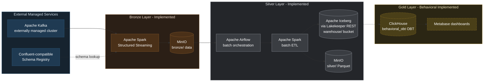
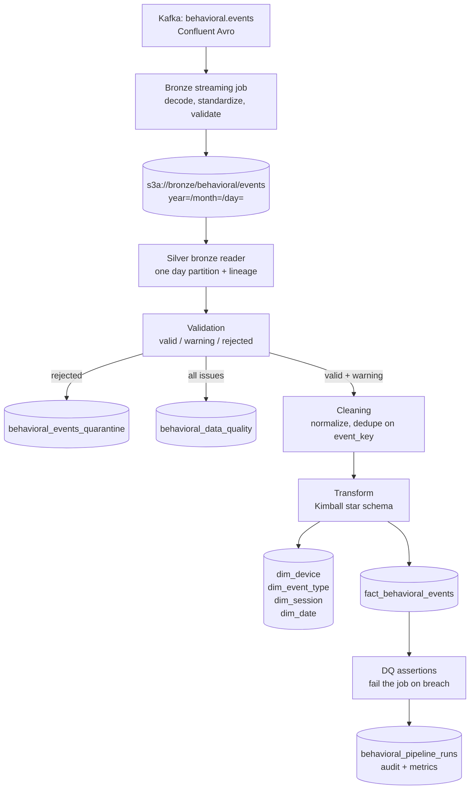
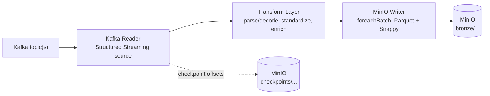
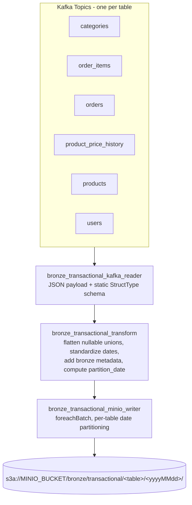
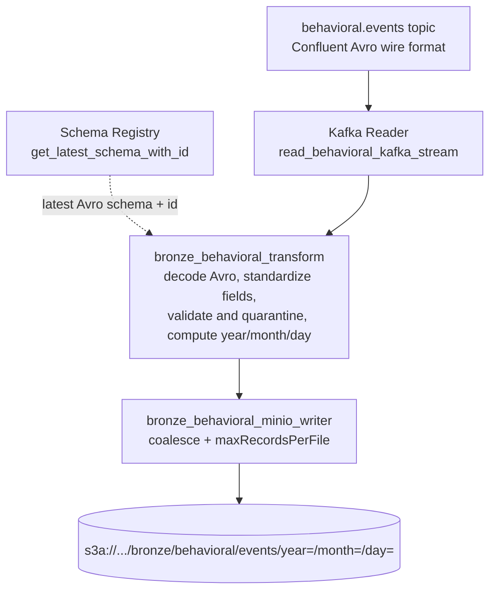
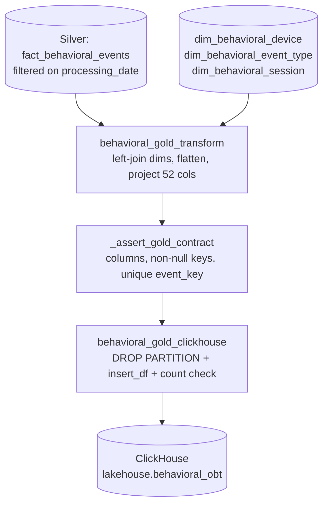

# Modern Data Analytics Platform

A Kafka-to-Lakehouse data platform built on Apache Spark, MinIO, Apache Iceberg, and a Confluent-compatible Schema Registry, orchestrated locally and on VPS via Docker Compose.

The platform follows a Medallion (Bronze / Silver / Gold) architecture. **This repository implements the Bronze and Silver layers, plus a Gold Behavioral load into ClickHouse.** The remaining Gold work — Gold Transactional and Metabase dashboards — is provisioned at the infrastructure level but not yet the focus of this document.

---

## Table of Contents

1. [Project Overview](#1-project-overview)
2. [Architecture Overview](#2-architecture-overview)
3. [Data Flow](#3-data-flow)
4. [Bronze Layer](#4-bronze-layer)
   - [4.1 Transactional Pipeline](#41-bronze-transactional-pipeline)
   - [4.2 Behavioral Pipeline](#42-bronze-behavioral-pipeline)
5. [Silver Layer](#5-silver-layer)
   - [5.1 Behavioral Pipeline](#51-silver-behavioral-pipeline)
   - [5.2 Transactional Pipeline](#52-silver-transactional-pipeline)
6. [Silver Processing Workflow](#6-silver-processing-workflow)
7. [Gold Layer](#7-gold-layer)
   - [7.1 Behavioral Pipeline](#71-gold-behavioral-pipeline)
8. [Input and Output Contracts](#8-input-and-output-contracts)
9. [Data Quality and Validation](#9-data-quality-and-validation)
10. [File and Module Responsibilities](#10-file-and-module-responsibilities)
11. [Repository Structure](#11-repository-structure)
12. [Technology Stack](#12-technology-stack)
13. [Configuration Management](#13-configuration-management)
14. [Installation and Development Setup](#14-installation-and-development-setup)
15. [Running the Pipeline](#15-running-the-pipeline)
16. [Logging and Error Handling](#16-logging-and-error-handling)
17. [Testing](#17-testing)
18. [Design Decisions](#18-design-decisions)
19. [Current Implementation Status](#19-current-implementation-status)
20. [Roadmap](#20-roadmap)
21. [Git Workflow](#21-git-workflow)
22. [Engineering Notes](#22-engineering-notes)

---

## 1. Project Overview

### Problem Statement

E-commerce systems produce two structurally different data streams: **transactional data** (orders, users, products, pricing) from operational systems, and **behavioral data** (clickstream, cart activity, search, page views) from user interaction tracking. Both need to land in a lake reliably, with schema enforcement and full lineage, before they can be cleaned, modeled, and served for analytics.

This platform ingests both streams from Kafka into a MinIO-backed Bronze layer using Apache Spark Structured Streaming, then refines them in a Silver layer built on Apache Iceberg, feeding a Gold (ClickHouse OLAP) layer for the Behavioral domain.

### Why a Medallion Architecture

Each layer has one job, and the boundary between them is what makes the platform debuggable:

- **Bronze** preserves what actually arrived. It never deduplicates, joins, or models. If a downstream layer has a bug, Bronze is still the unmodified record of the source, and the layer can simply be rebuilt from it.
- **Silver** is where correctness is enforced: validation, cleaning, deduplication, and dimensional modeling. It is the first layer that is safe to query for analysis.
- **Gold** denormalizes Silver into query-optimized structures for BI. Today this exists for Behavioral only.

Separating them means a schema change, a bad deploy, or a data-quality incident is contained to one layer and recoverable from the layer beneath it.

### Current Scope

- Two independent **Bronze** ingestion pipelines: Transactional and Behavioral.
- Two **Silver** pipelines with different maturity:
  - **Silver Behavioral** — complete: Iceberg star schema over MinIO via the Lakekeeper REST catalog, idempotent MERGE writes, quarantine, data-quality tables, and an Airflow DAG.
  - **Silver Transactional** — partial: validated and cleansed Parquet output. No Iceberg tables and no Kimball model yet.
- **Gold Behavioral** — implemented: Silver Behavioral Iceberg tables are flattened into a ClickHouse `behavioral_obt` One Big Table through a Spark job and Airflow DAG. See [Section 22](#22-engineering-notes) for open issues discovered during manual verification.
- Local/VPS infrastructure for the full target stack via Docker Compose.
- Kafka and the Schema Registry are treated as externally managed dependencies, not started by this repository.

### Current Maturity Level

Active development. Bronze ingestion is implemented for both pipelines. The Silver Behavioral pipeline is production-shaped and orchestrated. The Behavioral Gold load is implemented for ClickHouse and has been run and verified manually end-to-end, but see [Section 22](#22-engineering-notes) for issues found during that verification that should be resolved before relying on the scheduled DAG run. The Silver Transactional pipeline cleanses data but does not yet produce dimensional tables, so cross-domain Gold and BI dashboards are still pending — see [Section 19](#19-current-implementation-status) for a precise breakdown.

---

## 2. Architecture Overview

Kafka and the Schema Registry are external systems the platform connects to but does not provision. Everything from Spark onward is provisioned by this repository's Docker Compose stack.



Solid nodes and edges are implemented today. ClickHouse now has a Behavioral Gold load path, verified with a manual end-to-end run (see [Section 22](#22-engineering-notes)). Metabase dashboards and cross-domain Gold remain future work.

**A note on the Iceberg catalog.** The Compose stack defines *two* Iceberg REST catalog services: `iceberg-rest` (tabulario 1.6.0) and `lakekeeper`. The pipeline environment (`x-pipeline-env`, `x-airflow-common-env`) points at **Lakekeeper**, which is the catalog the Silver Behavioral pipeline actually uses. See [Section 22](#22-engineering-notes).

**A note on the Iceberg client library version.** `docker.arvancloud.ir/apache/spark:3.5.3` — the exact image `spark-master` and `spark-worker` pull, unmodified — ships with Iceberg `1.5.0` jars already baked into `/opt/spark/jars`. This is **not configured anywhere in this repository**; it is an artifact of that specific mirrored image. Meanwhile `silver_behavioral_config.py` declares `ICEBERG_VERSION = "1.6.1"` and both the Silver and Gold DAGs pass `--packages ...iceberg-spark-runtime:1.6.1` at submit time. Running with `--packages` on top of the baked-in `1.5.0` jars causes a driver/executor classloading conflict (`InvalidClassException` / `ClassCastException` on `PartitionSpec` and `List$SerializationProxy`). See [Section 22](#22-engineering-notes) for the workaround used to verify Gold manually, and for the two ways to resolve this permanently.

---

## 3. Data Flow

```text
Kafka topics (external)
        |
        v
Bronze Layer  --  Spark Structured Streaming, append-only Parquet
        |
        +--> s3a://bronze/transactional/<table>/<yyyyMMdd>/
        |
        +--> s3a://bronze/behavioral/events/year=/month=/day=/
                 |
                 v
Silver Layer  --  Spark batch ETL, orchestrated by Airflow
        |
        +--> Iceberg star schema      (Behavioral, via Lakekeeper)
        +--> s3a://silver/transactional/<table>/   (Transactional, Parquet)
                 |
                 v
Gold Layer  --  ClickHouse behavioral_obt OBT -> Metabase-ready queries
```

End to end, for the Behavioral stream:



**Key point:** records flagged with *warnings* are not dropped. They flow into the fact table with their flags attached as `dq_flags`, and are also recorded in the quality table. Only records with *errors* are diverted to quarantine.

> **Note on table names.** The table names above (`dim_behavioral_device`, `dim_behavioral_event_type`, `dim_behavioral_session`, `behavioral_events_quarantine`, `behavioral_validation_issues`, `behavioral_pipeline_state`) are the **actual** Iceberg table names defined in `src/common/silver_behavioral_schema.py` (`TABLE_DIM_DEVICE`, `TABLE_DIM_EVENT_TYPE`, `TABLE_DIM_SESSION`, `TABLE_QUARANTINE`, `TABLE_QUALITY`, `TABLE_PIPELINE_STATE`). Earlier drafts of this README referred to these as `dim_device`, `dim_event_type`, `dim_session`, `behavioral_data_quality`, and `behavioral_pipeline_runs` — those names do not exist in the schema module and should not be used when writing SQL or DAG references against the real tables.

---

## 4. Bronze Layer

### Purpose

Land raw events from Kafka into MinIO as Parquet, with minimal, well-defined transformations: schema parsing/decoding, basic standardization, lineage metadata, and partitioning. The Bronze layer intentionally does not deduplicate, join, or model data — that is Silver's responsibility.

### Responsibilities

- Consume Kafka topics via Spark Structured Streaming.
- Parse or decode the wire format (JSON for Transactional, Confluent Avro for Behavioral) against a known schema.
- Attach ingestion lineage metadata (source table/topic, ingestion timestamp, and — for Behavioral — schema id).
- Partition output by date for efficient downstream reads.
- Write append-only, Snappy-compressed Parquet to MinIO with streaming checkpoints for exactly-once micro-batch semantics.

### Data Flow (shared pattern)

Both pipelines follow the same four-stage shape, implemented independently per pipeline:



### Execution

Streaming jobs, run with `spark-submit` inside `spark-master`. See [Section 15](#15-running-the-pipeline).

> **Note.** The repository root `Dockerfile` builds a standalone image whose `CMD` runs `bronze_transactional_job.py` with `spark-sql-kafka` and `hadoop-aws` packages. This image is **not** referenced by `docker-compose.yml` — `spark-master` and `spark-worker` pull `docker.arvancloud.ir/apache/spark:3.5.3` directly as a prebuilt image with no custom build step. The root `Dockerfile` therefore documents one way to package and run the Bronze job standalone, but is not part of the actual Compose-orchestrated runtime path today.

---

### 4.1 Bronze Transactional Pipeline

#### Purpose

Ingest six core e-commerce entities from Kafka, one topic per table, using statically defined schemas.

#### Components

| Module | File |
|---|---|
| Kafka Reader | `src/common/bronze_transactional_kafka_reader.py` |
| Transform | `src/common/bronze_transactional_transform.py` |
| Spark Session | `src/common/bronze_transactional_spark_session.py` |
| MinIO Writer | `src/common/bronze_transactional_minio_writer.py` |
| Avro helpers | `src/common/bronze_transactional_avro.py` |
| Schemas | `src/schemas/bronze_transactional_schemas.py` |
| Job Entrypoint | `src/jobs/bronze_transactional_job.py` |

#### Tables and Partition Source

Each table is read from its own Kafka topic and parsed against a static PySpark `StructType`. Because not every topic carries a business timestamp, the partition date is derived per table:

| Table | Partition Source Column | Nullable Union Fields Flattened |
|---|---|---|
| `orders` | `event_timestamp` (from `timestamp`) | `payment_method` |
| `product_price_history` | `valid_from_timestamp` (from `valid_from`) | — |
| `users` | `signup_date` | `loyalty_tier`, `location` |
| `categories` | `_kafka_timestamp` (fallback) | `parent_category_id` |
| `order_items` | `_kafka_timestamp` (fallback) | — |
| `products` | `_kafka_timestamp` (fallback) | — |

"Nullable union fields" are Avro-style `{"string": "value"}` wrapper objects flattened into plain nullable string columns.

#### Flow



One streaming query is started per table; the job awaits termination of any query and stops all queries cleanly on shutdown or failure.

---

### 4.2 Bronze Behavioral Pipeline

#### Purpose

Ingest a single clickstream/behavioral events topic (`behavioral.events`) encoded in Confluent Avro wire format, with the schema resolved dynamically from a Schema Registry rather than hardcoded.

#### Components

| Module | File |
|---|---|
| Kafka Reader | `src/common/bronze_behavioral_kafka_reader.py` |
| Transform | `src/common/bronze_behavioral_transform.py` |
| Spark Session | `src/common/bronze_behavioral_spark_session.py` |
| MinIO Writer | `src/common/bronze_behavioral_minio_writer.py` |
| Registry Client | `src/common/registry_client.py` |
| Schema Metadata | `src/schemas/bronze_behavioral_schemas.py` |
| Job Entrypoint | `src/jobs/bronze_behavioral_job.py` |

#### Design Highlights

- **Confluent wire-format decoding**: each Kafka message is decoded by stripping the magic byte and 4-byte schema id before Avro-decoding the payload (`PERMISSIVE` mode).
- **Quarantine, not drop**: records that fail to decode, or whose wire-format schema id doesn't match the schema fetched from the registry, are **kept** with `decode_success`, `schema_id_matches`, `decode_error`, `validation_errors`, and `is_valid` columns populated, so Silver can route them to quarantine instead of the stream failing.
- **Partition fallback**: `year`/`month`/`day` are derived from `event_timestamp` when it parses correctly, falling back to the Kafka broker's own timestamp so records never land in a null partition.
- **Derived `event_id`**: the transform overwrites the payload's `event_id` with `sha2(kafka_topic || kafka_partition || kafka_offset, 256)`. This makes `event_id` unique and non-null by construction, which Silver relies on — but it also means the producer's original `event_id` is not preserved. See [Section 22](#22-engineering-notes).

#### Flow



---

## 5. Silver Layer

### Purpose

Turn the raw Bronze record into data that is safe to analyze. Silver is where the platform decides what is trustworthy, makes it uniform, and models it dimensionally.

### Why Silver Exists Separately From Bronze

Bronze answers *"what arrived?"*. Silver answers *"what is true?"*. Keeping them apart means:

- Rejecting a record is reversible. Quarantine and quality decisions live in Silver, so a rule change is a Silver re-run over unchanged Bronze data — no re-ingestion from Kafka.
- Bronze can stay a fast, append-only stream with no business logic in the hot path.
- Silver can be batch, idempotent, and re-runnable, which is a fundamentally different execution model from streaming.

### Problems Silver Solves

| Problem in Bronze | Silver's answer |
|---|---|
| Duplicate events from streaming retries and backfills | Deduplication on a deterministic `event_key` |
| Mixed casing, blank strings, `"N/A"`, `"unknown"` placeholders | Normalization and null-like collapsing |
| Broken records mixed in with good ones | Three-way split: valid / warning / rejected |
| No dimensional structure; wide raw rows | Kimball star schema (facts + dimensions) |
| No way to answer "how bad is the data?" | Dedicated quality and audit tables |
| Reruns would double-count | Idempotent MERGE on natural keys |

### Two Pipelines, Different Maturity

The Silver layer contains **two independent pipelines owned by different teams**. They are structurally isolated: no shared module, no shared Spark session, no cross-imports. This is deliberate — see [Section 18](#18-design-decisions).

| | Silver Behavioral | Silver Transactional |
|---|---|---|
| Status | Complete | Partial |
| Output format | Apache Iceberg | Parquet |
| Catalog | Lakekeeper REST | None |
| Dimensional model | Yes (star schema) | Not yet |
| Orchestrated | Yes (Airflow DAG) | No DAG yet |
| Idempotent | Yes (MERGE) | No (`overwrite`) |
| Quality tables | Yes | Attempted; see [Section 22](#22-engineering-notes) |

---

### 5.1 Silver Behavioral Pipeline

Reads one day of Bronze behavioral Parquet and produces an Iceberg star schema via the Lakekeeper REST catalog.

#### Module Structure and Why It Exists

The Behavioral pipeline is split into nine single-responsibility modules. The split is not decoration — each module exists because it owns a decision that must be testable and changeable in isolation:

| Module | Owns | Why separate |
|---|---|---|
| `silver_behavioral_config.py` | Env vars, package list, table names, paths | Imports no PySpark, so the Airflow DAG can import it at parse time. This is what guarantees the DAG and the job use **one** Spark package list rather than two hand-copied ones that drift. |
| `silver_behavioral_spark_session.py` | Session + Iceberg/S3A configuration | Keeps catalog wiring out of business logic |
| `silver_behavioral_schema.py` | All Iceberg DDL + additive schema evolution | DDL is behavioral-owned; keeping it out of any shared module means the other team can change catalog config without touching table definitions |
| `silver_behavioral_bronze_reader.py` | Read + partition prune + lineage | A pure read. No validation, no renaming |
| `silver_behavioral_validation.py` | valid / warning / rejected split, `event_key` | The one place that decides what is trustworthy |
| `silver_behavioral_cleaning.py` | Normalization, dedupe | Cleaning must never override a validation decision |
| `silver_behavioral_transform.py` | Kimball modeling only | Business logic with no I/O — trivially unit-testable |
| `silver_behavioral_iceberg_writer.py` | Merge strategies | One generic MERGE is unsafe; strategy per table |
| `silver_behavioral_quality_writer.py` | Quality, quarantine, audit writes | All three destinations, all idempotent |

#### The `event_key` Contract

The fact grain is one row per unique behavioral event, keyed on `event_key`, derived in this order:

1. `event_id`, when present and non-blank.
2. Otherwise `sha256(kafka_topic || kafka_partition || kafka_offset)`.

The topic is included deliberately: a Kafka offset is only unique *within* a topic partition, so partition+offset alone would collide as soon as a second behavioral topic is ingested.

Records with neither a usable `event_id` nor usable Kafka coordinates are **rejected**, not silently assigned a key.

#### Merge Strategies

Different tables need different write semantics. Using `WHEN MATCHED THEN UPDATE SET *` everywhere is actively harmful: `first_seen_at` in a dimension is computed as the *current batch's* minimum, so a blanket overwrite would destroy the true first-sighting on every run.

| Strategy | Used by | Behavior |
|---|---|---|
| `FACT_DEDUPLICATE_INSERT` | `fact_behavioral_events` | Insert-only on `event_key`. Events are immutable; reruns are no-ops |
| `UPSERT_PRESERVE_FIRST_SEEN` | `dim_device`, `dim_event_type`, `dim_session`, `behavioral_data_quality` | `first_seen := least(stored, incoming)`, `last_seen := greatest(stored, incoming)` |
| `INSERT_ONLY` | `dim_date`, `behavioral_events_quarantine` | Insert new keys only; never rewrite |
| `UPSERT_ALL` | `behavioral_pipeline_runs` | Full overwrite of the matched run row |
| `SCD_TYPE_2` | — | Declared but **not implemented**; raises `NotImplementedError`. No Behavioral dimension currently requires history tracking |

#### Idempotency

Every write is a MERGE on a deterministic key. Re-running the same partition, an Airflow retry, and a backfill all converge to the same result:

- `fact_behavioral_events` — insert-only on `event_key`
- `dim_*` — upsert on the natural key, preserving first-seen
- `behavioral_events_quarantine` — insert-only on `event_key`
- `behavioral_data_quality` — upsert on `quality_key`, a deterministic hash of `(source_table, event_key, issue_type, error_code, event_date)`
- `behavioral_pipeline_runs` — upsert on `pipeline_run_id`, which is deterministic per processing date (`silver_behavioral_etl::YYYY-MM-DD`)

#### Outputs

| Table | Namespace | Grain |
|---|---|---|
| `fact_behavioral_events` | `silver` | One behavioral event |
| `dim_session` | `silver` | One session |
| `dim_device` | `silver` | One device type |
| `dim_event_type` | `silver` | One event type + category |
| `dim_date` | `silver` | One calendar day (shared conformed dimension) |
| `behavioral_events_quarantine` | `silver` | One rejected event |
| `behavioral_data_quality` | `silver_quality` | One (record, issue) pair |
| `behavioral_pipeline_runs` | `silver_quality` | One pipeline run |

---

### 5.2 Silver Transactional Pipeline

Reads Bronze transactional Parquet per table, validates, cleans, and writes cleansed Parquet.

#### What is implemented

- `silver_transactional_bronze_reader.py` — reads one table's Bronze Parquet with `_source_file` lineage.
- `silver_transactional_validation.py` — `ValidationResult(valid_df, rejected_df, quality_issues_df)`; per-table required-field, type, and range rules; timestamp repair.
- `silver_transactional_cleaning.py` — trimming, null-like collapsing, type casting, exact-duplicate removal on the natural record id.
- `silver_transactional_quality_writer.py` — writes quality issues to an Iceberg table.
- `configs/spark/silver_transactional_config.py` — supported tables and Bronze column contracts.
- `src/jobs/silver_transactional_job.py` — loops the six tables: read → validate → write quality issues → clean → write Parquet.

#### What is not implemented

- **No Iceberg output.** The job writes `mode('overwrite')` Parquet to `s3a://silver/transactional/<table>/`.
- **No Kimball model.** There is no `dim_user`, `dim_product`, `fact_order`, or SCD Type 2 yet. This is the largest remaining gap in the Silver layer.
- **No Airflow DAG.** The job is run manually.
- **Not idempotent by design** — `overwrite` replaces the table on each run. This is safe to re-run but cannot process incrementally.
- `silver_transactional_spark_session.py` exists and configures Iceberg, but the job does not import it; it builds its own plain Spark session instead.

See [Section 22](#22-engineering-notes) for issues in this pipeline that should be resolved before it is relied on.

---

## 6. Silver Processing Workflow

The steps below are the actual sequence in `src/jobs/silver_behavioral_job.py`.

1. **Create the Spark session** and validate runtime configuration (fails fast if MinIO credentials or URLs are missing).
2. **Ensure namespaces and tables** — `CREATE NAMESPACE / TABLE IF NOT EXISTS`, then additive `ALTER TABLE ADD COLUMNS` for any column missing from an already-deployed table.
3. **Read the Bronze partition** for the processing date, attaching `bronze_file_path` lineage. An empty partition ends the run as `SUCCESS_EMPTY` — not a failure.
4. **Validate** — derive `event_key`, carry Bronze's own errors forward with a `bronze:` prefix, apply Silver error and warning rules, split into valid / warning / rejected.
5. **Quarantine** rejected records (MERGE, insert-only).
6. **Write quality findings** for every error and warning.
7. **Clean** the processable records (valid + warning) and deduplicate on `event_key`.
8. **Merge lookup dimensions** — `dim_behavioral_device`, `dim_behavioral_event_type`, preserving `first_seen_at`.
9. **Merge the fact table** — insert-only on `event_key`.
10. **Recompute `dim_behavioral_session`** from the fact table for touched sessions only, then merge.
11. **Run data-quality assertions** against the written partition. Any breach raises and fails the task.
12. **Record the run** in `behavioral_pipeline_state` with counts and status.
13. **Stop the Spark session** in a `finally` block.

On failure, the run is recorded as `FAILED` with the error message, and the original exception is re-raised so `spark-submit` exits non-zero and Airflow marks the task failed.

---

## 7. Gold Layer

### Purpose

Turn the Silver star schema into a single, denormalized structure that a BI tool can query without joins. Gold does no validation and no cleaning — Silver already guaranteed correctness. Gold's one job is to **flatten and serve**: read the conformed facts and dimensions, join them, and land one wide, query-optimized row per grain in an OLAP engine.

### Why Gold Exists Separately From Silver

Silver answers *"what is true?"* in a normalized, storage-optimized star. Gold answers *"what is fast to query?"* in a denormalized, read-optimized table. Keeping them apart means:

- Silver stays the normalized source of truth. A change to how the OBT is shaped — a new column, a different sort key — is a Gold rebuild over unchanged Silver Iceberg tables, never a Silver re-run.
- Gold can target an engine (ClickHouse) tuned for wide scans and aggregation, with an on-disk layout (sort key, partitioning) chosen purely for query speed.
- Gold reads are decoupled from the write path: rebuilding a day of Gold never touches Silver, Bronze, or Kafka.

### Two Pipelines, Different Maturity

Like Silver, the Gold layer is split by domain. Only the Behavioral pipeline is implemented in code today.

| | Gold Behavioral | Gold Transactional |
|---|---|---|
| Status | Implemented, manually verified | Not covered here |
| Target | ClickHouse `behavioral_obt` | — |
| Orchestrated | Yes (Airflow DAG) | — |
| Idempotent | Yes (partition reload) | — |

> This section documents **Gold Behavioral** only. Gold Transactional modules and the ClickHouse realtime views also exist in the repository but are outside the scope of this README section.

---

### 7.1 Gold Behavioral Pipeline

Reads the Silver Behavioral Iceberg star for one processing date and loads a denormalized One Big Table (OBT) into ClickHouse.

#### Module Structure and Why It Exists

| Module | Owns | Why separate |
|---|---|---|
| `src/common/behavioral_gold_config.py` | ClickHouse settings, Silver table resolution, and the canonical Gold column list | Single source of truth for the schema contract; imports no PySpark, so the DAG can construct/validate it at parse time |
| `src/common/behavioral_gold_transform.py` | The Silver → OBT join and projection; no I/O | Pure DataFrame logic — the flatten is unit-testable without a catalog or ClickHouse |
| `src/common/behavioral_gold_clickhouse.py` | ClickHouse client, DDL, and the idempotent partition reload | Keeps all ClickHouse-specific SQL and the `clickhouse_connect` dependency out of the transform |
| `src/jobs/gold_behavioral_job.py` | Orchestration only: build → assert contract → replace partition | Sequencing and exit codes, no business logic |
| `workflow/dags/gold_behavioral_dag.py` | Airflow DAG; waits on Silver, checks ClickHouse, submits the job | Orchestration and upstream coupling live here, not in the job |
| `sql/clickhouse/001_behavioral_gold_obt.sql` | Standalone DDL for `behavioral_obt` | Runs on ClickHouse startup via the init mount; matches the embedded DDL the writer also applies |
| `sql/clickhouse/behavioral_gold_verification.sql` | Post-load verification queries | Row/uniqueness counts and category/device/attribution rollups for a loaded date, parameterized on `{ds:Date}` |

#### The OBT Design

The transform reads one day of `fact_behavioral_events` (filtered on `processing_date`) and left-joins the three lookup dimensions to overlay descriptive attributes:

| Silver source table | Namespace | Contributes |
|---|---|---|
| `fact_behavioral_events` | `behavioral` | Grain, measures, keys, lineage |
| `dim_behavioral_device` | `behavioral` | `device_name` |
| `dim_behavioral_event_type` | `behavioral` | `event_category` |
| `dim_behavioral_session` | `behavioral` | `session_start_at`, `session_end_at`, `session_duration_sec`, `primary_device_key`, `session_event_count` |

The result is one denormalized row per event. Nested fact columns (`cart_items`, `dq_flags`) are serialized to JSON strings (`cart_items_json`, `dq_flags_json`) because the OBT is a flat table, and `gold_loaded_at` is stamped at load time.

> These table names are consistent between `silver_behavioral_schema.py` and `behavioral_gold_config.py`/`behavioral_gold_transform.py` — no reconciliation is pending here (an earlier draft of this note flagged a naming drift; that drift exists only against outdated descriptions elsewhere in this document, not against the code Gold actually reads).

#### The Column Contract

`GOLD_BEHAVIORAL_COLUMNS` in `behavioral_gold_config.py` is the single source of truth for the OBT's 52 columns, in exactly the order the DDL expects. Four components must agree on it:

- the transform, which projects the final DataFrame in this order;
- the DDL (`001_behavioral_gold_obt.sql` and the embedded `CREATE_BEHAVIORAL_GOLD_TABLE_SQL`);
- the writer, which passes it as `column_names` to `clickhouse_connect.insert_df`;
- the job's `_assert_gold_contract`, which fails the run before any write if `df.columns` drifts from the contract.

`_assert_gold_contract` additionally rejects the batch if `event_key`, `event_timestamp`, `date_key`, or `silver_ingestion_timestamp` is null, or if any `event_key` is duplicated — so a malformed OBT never reaches ClickHouse.

The standalone DDL (`sql/clickhouse/001_behavioral_gold_obt.sql`) and the embedded DDL (`CREATE_BEHAVIORAL_GOLD_TABLE_SQL` in `behavioral_gold_clickhouse.py`) were compared directly and are **identical** column-for-column, type-for-type, including the `ReplacingMergeTree(gold_loaded_at)` engine, `PARTITION BY processing_date`, and the same `ORDER BY` key. No drift found between them as of this writing.

#### Idempotency

The target table is a `ReplacingMergeTree(gold_loaded_at)` partitioned by `processing_date`. A reload of a date is a cheap `ALTER TABLE ... DROP PARTITION '<date>'` followed by a bulk insert of that day's rows, so an Airflow retry or a manual re-run converges to the same result rather than appending duplicates. After the insert, the writer counts the partition's rows and raises `BehavioralGoldWriteError` on a source-vs-loaded count mismatch.

> **Fixed defect.** The `DROP PARTITION` statement previously wrapped the partition value in `toDate(...)`: `DROP PARTITION toDate('{partition}')`. ClickHouse's `ALTER TABLE ... DROP PARTITION` grammar does not accept a function call there — only a literal matching the partition column's type — and this raised `Code: 62. DB::Exception: Syntax error` on every load. The fix is to pass the ISO date string directly: `DROP PARTITION '{partition}'`. This has been applied in `behavioral_gold_clickhouse.py` and verified working end-to-end; it should be confirmed as committed if you are reading this from a checkout that predates the fix.

#### Processing Workflow

The sequence in `src/jobs/gold_behavioral_job.py`:

1. **Build config** from the environment (`GoldBehavioralConfig.from_env`), resolving both the ClickHouse target and the Silver Iceberg table paths.
2. **Create the Spark session** using the shared Silver Behavioral session factory (same Iceberg/Lakekeeper/S3A wiring).
3. **Build the OBT** — read the fact partition, left-join the three dimensions, project the canonical column list, and cache.
4. **Assert the contract** — column order, non-null key columns, and `event_key` uniqueness.
5. **Replace the partition** — ensure the database/table exist, `DROP PARTITION` for the date, bulk-insert, then verify the loaded row count.
6. **Stop the Spark session** and unpersist in a `finally` block.



#### Outputs

| Table | Database | Engine | Grain |
|---|---|---|---|
| `behavioral_obt` | `lakehouse` | `ReplacingMergeTree(gold_loaded_at)`, `PARTITION BY processing_date` | One behavioral event |

The sort key is `(processing_date, event_category, event_type, user_key, session_key, event_key)`, chosen for the category/funnel and per-user/session rollups the verification queries and future dashboards run. Timestamp columns are typed `DateTime64(3, 'Asia/Tehran')`.

#### Operational Notes From Manual Verification

A manual, non-Airflow run of this pipeline against the live stack surfaced several issues that are **not yet reflected in the DAG or Docker images**, and should be resolved before trusting the scheduled `0 3 * * *` run:

1. **Iceberg version mismatch (see [Section 2](#2-architecture-overview) and [Section 22](#22-engineering-notes)).** The DAG's `--packages` derives `iceberg-spark-runtime:1.6.1` from `spark_packages_csv()`, but the actual `docker.arvancloud.ir/apache/spark:3.5.3` image ships `1.5.0` baked in. This caused `InvalidClassException`/`ClassCastException` failures. Manual verification worked around this with `--jars /opt/spark/jars/iceberg-spark-runtime-3.5_2.12-1.5.0.jar,/opt/spark/jars/iceberg-aws-bundle-1.5.0.jar` in place of `--packages`, but the DAG itself has not been updated and will likely hit the same failure on its next scheduled run.
2. **Spark worker staleness.** A worker that had been running since well before a Spark/Iceberg-related image or jar change produced Scala serialization errors (`ClassCastException` on `List$SerializationProxy`) distinct from the Iceberg-specific error above. Restarting the worker resolved it. Confirm workers are recycled after any change to the Spark image or jars.
3. **Executor memory.** A default `1024 MiB` executor ran out of headroom during the `toPandas()` collect in `replace_behavioral_gold_partition`, surfacing as a Netty `collectToPython` connection failure rather than an explicit OOM message. The DAG already requests `--executor-memory '4g'`, which is more generous than the manual default that failed — but this has not been load-tested against a full day's partition size.
4. **`DROP PARTITION toDate(...)` defect** — see the Idempotency section above. Fixed in code; confirm it is committed.

#### Recommended Follow-Ups

- [ ] Either pin `ICEBERG_VERSION` in `silver_behavioral_config.py` to `1.5.0` to match the actual base image, or update the base image so it ships `1.6.1` and matches the declared config. Whichever direction is chosen, the DAG's `--packages` and the image's baked-in jars must agree.
- [ ] Confirm the `DROP PARTITION '{partition}'` fix (no `toDate()` wrapper) is committed to `behavioral_gold_clickhouse.py`.
- [ ] Add a Gold-specific automated test (see [Section 17](#17-testing) — no test file for either Silver or Gold Behavioral currently exists in the repository, despite being described in earlier drafts of this document).
- [ ] Confirm executor memory sizing against a realistic full-day partition, not just the ~374K-row day used for manual verification.

---

## 8. Input and Output Contracts

### Bronze Behavioral output = Silver Behavioral input

Selected columns (the full Bronze schema is wider). Types are as written to Parquet.

| Column | Type | Description | Required by Silver |
|---|---|---|---|
| `event_id` | string | sha256 of topic+partition+offset (see [Section 4.2](#42-bronze-behavioral-pipeline)) | Preferred key source |
| `user_id` | string | User identifier; null for anonymous traffic | No (warning if absent) |
| `session_id` | string | Session identifier | Yes |
| `event_type` | string | e.g. `page_view`, `add_to_cart`, `search_product` | Yes |
| `event_timestamp` | timestamp | Parsed event time | Yes |
| `device_type` | string | Raw device string | No (warning if absent/unknown) |
| `ip_address` | string | Client IP | No (warning if malformed) |
| `utm_source` | string | Acquisition source | No (warning if absent) |
| `timestamp` | string | Raw source timestamp string | No |
| `kafka_topic` | string | Lineage; key fallback component | Yes (reader fails if absent) |
| `kafka_partition` | int | Lineage; key fallback component | Yes |
| `kafka_offset` | bigint | Lineage; key fallback component | Yes |
| `kafka_timestamp` | timestamp | Broker timestamp | Yes |
| `bronze_ingestion_timestamp` | timestamp | Bronze write time | Yes |
| `is_valid` | boolean | Bronze validation verdict | No |
| `validation_errors` | array\<string\> | Bronze error codes | No |
| `raw_value` | binary | Original Avro payload | No |
| `year`, `month`, `day` | int | Partition columns | Yes |

The Silver Bronze reader **fails the job** if any lineage column is missing — records that cannot be traced back to their Kafka message are not acceptable input.

### Silver Behavioral output: `fact_behavioral_events`

34 columns. Key groups:

| Column | Type | Description |
|---|---|---|
| `event_key` | string | Grain / merge key |
| `event_id` | string | Natural source id, preserved |
| `date_key` | int | `yyyyMMdd`, joins `dim_date` |
| `user_id` | string | **Natural key** — not a surrogate. See [Section 17](#17-design-decisions) |
| `session_id`, `device`, `event_type` | string | Natural dimension keys |
| `event_timestamp` | timestamp | Fact partition column (`days(event_timestamp)`) |
| `ip_address`, `utm_source` | string | Source attributes |
| `quantity`, `cart_value`, `duration_sec`, `rating`, `http_status`, `results_count`, `clicked_position`, `text_length`, `cart_total_items` | int / double | Measures |
| `cart_items` | array\<struct\> | Cart contents |
| `dq_flags` | array\<string\> | Warning flags carried from validation |
| `kafka_topic`, `kafka_partition`, `kafka_offset`, `kafka_timestamp` | — | Lineage only; not keys |
| `bronze_file_path`, `bronze_ingestion_timestamp`, `processing_date`, `pipeline_run_id`, `silver_ingestion_timestamp` | — | Lineage / audit |

### Silver Transactional output

Cleansed Parquet at `s3a://silver/transactional/<table>/`, one directory per table, written with `mode('overwrite')`. The schema is the Bronze schema after cleaning; it is **not** a modeled star schema and is not registered in any catalog.

---

## 9. Data Quality and Validation

### Bronze-level

The Behavioral transform attaches `decode_success`, `schema_id_matches`, `decode_error`, `validation_errors`, and `is_valid`. Nothing is dropped.

### Silver Behavioral: three severities

| Severity | Meaning | Destination |
|---|---|---|
| **Error** | Cannot be modeled | Quarantine. Excluded from the fact |
| **Warning** | Usable but suspicious | **Kept**, flows into the fact with `dq_flags` |
| **Clean** | No findings | Fact |

Both errors and warnings are written to `behavioral_data_quality`.

#### Error rules (reject)

- No reliable unique key (`event_key` cannot be derived)
- Missing `session_id`, `event_type`, or `event_timestamp`
- Unparseable source timestamp
- Avro decode failure (`decode_success = false`)
- Any Bronze error, carried forward with a `bronze:` prefix

#### Warning rules (keep and flag)

- `user_id:missing_anonymous_user` — anonymous traffic is expected, not broken
- `utm_source:missing`, `device_type:missing`, `device_type:unknown_value`
- `ip_address:invalid_format` — the raw value is **retained**, so the flag is actionable
- Business anomalies: negative `cart_value`, non-positive `quantity`, negative `duration_sec` / `results_count` / `clicked_position` / `text_length`, `rating` outside 1–5, `http_status` outside 100–599

Bronze treats a missing `user_id` or `device_type` as fatal; Silver **downgrades both to warnings**, because rejecting anonymous traffic would understate every funnel metric.

### Cleaning rules

- **Identity fields** (`event_key`, `event_id`, `session_id`, `event_type`, `device`) — trimmed only, never collapsed to null. Collapsing `"unknown"` to null here would void a record validation just approved, and a null key can never match a MERGE `ON` clause.
- **Descriptive fields** — trimmed, and `""` / `null` / `none` / `n/a` / `na` / `unknown` / `-` collapsed to null.
- **Case** — `event_type`, `device`, `payment_type`, `shipping_method`, `fulfillment_speed`, `utm_source` lowercased.
- **Types** — `try_cast` to the DDL type, yielding null rather than failing the job.
- **Deduplication** — `row_number()` over `event_key` ordered by `(bronze_ingestion_timestamp, kafka_offset)`, keeping the earliest copy. Deterministic across runs, unlike `dropDuplicates`.

### Post-write assertions

After the fact MERGE, the job asserts against the written partition:

- No null `event_key`
- `event_key` unique within the partition
- No null `date_key`
- Fact row count equals the clean event count

Any breach raises `SilverBehavioralError` and fails the task.

### Gold Behavioral: contract assertions

`_assert_gold_contract` in `gold_behavioral_job.py` runs before any ClickHouse write and fails the job if:

- `df.columns` does not exactly match `GOLD_BEHAVIORAL_COLUMNS` in order,
- `event_key`, `event_timestamp`, `date_key`, or `silver_ingestion_timestamp` is null anywhere in the batch, or
- any `event_key` appears more than once.

Separately, `replace_behavioral_gold_partition` verifies the ClickHouse-loaded row count matches the source DataFrame's row count and raises `BehavioralGoldWriteError` on mismatch.

### Silver Transactional

`validate_transactional_data` returns `ValidationResult(valid_df, rejected_df, quality_issues_df)` with per-table rules and timestamp repair. Rejected records are excluded from the cleaned output. See [Section 22](#22-engineering-notes) regarding quality-issue persistence.

---

## 10. File and Module Responsibilities

### Bronze

| File or Module | Layer | Responsibility | Input | Output |
|---|---|---|---|---|
| `src/jobs/bronze_transactional_job.py` | Bronze | Entrypoint; one streaming query per table | Kafka topics | Streaming queries |
| `src/jobs/bronze_behavioral_job.py` | Bronze | Entrypoint; resolves Avro schema, starts one query | `behavioral.events` | Streaming query |
| `src/common/bronze_transactional_kafka_reader.py` | Bronze | Structured Streaming source; retains Kafka metadata | Topic name, schema | Parsed DataFrame |
| `src/common/bronze_behavioral_kafka_reader.py` | Bronze | Structured Streaming source for the events topic | Topic name | Raw DataFrame |
| `src/common/bronze_transactional_transform.py` | Bronze | Flatten unions, standardize dates, add metadata | Raw DataFrame | Bronze DataFrame |
| `src/common/bronze_behavioral_transform.py` | Bronze | Avro decode, standardize, validate, partition | Raw DataFrame | Bronze DataFrame |
| `src/common/bronze_transactional_avro.py` | Bronze | Avro helpers for the transactional stream | Bytes | Decoded columns |
| `src/common/bronze_*_spark_session.py` | Bronze | Session + S3A config, per pipeline | Env vars | SparkSession |
| `src/common/bronze_*_minio_writer.py` | Bronze | `foreachBatch` Parquet write + checkpoint | DataFrame | Parquet in MinIO |
| `src/common/registry_client.py` | Shared | Fetch latest Avro schema + id by subject | Subject | Schema, schema id |
| `src/schemas/bronze_transactional_schemas.py` | Bronze | Static `StructType` per table | — | Schemas |
| `src/schemas/bronze_behavioral_schemas.py` | Bronze | Column contracts only (registry is source of truth) | — | Constants |

### Silver — Behavioral

| File or Module | Layer | Responsibility | Input | Output |
|---|---|---|---|---|
| `src/jobs/silver_behavioral_job.py` | Silver | Orchestration only; sequencing, metrics, exit codes | `--execution-date` | Iceberg tables |
| `src/jobs/silver_behavioral_migration_job.py` | Silver | One-time `event_key` migration; `--dry-run` | Fact + Bronze | Rewritten `event_key` |
| `src/common/silver_behavioral_config.py` | Silver | Env, packages, table names, run id. No PySpark import | Env vars | Config values |
| `src/common/silver_behavioral_spark_session.py` | Silver | Session + Iceberg/Lakekeeper/S3A config | Config | SparkSession |
| `src/common/silver_behavioral_schema.py` | Silver | All Iceberg DDL + additive evolution | SparkSession | Tables ready |
| `src/common/silver_behavioral_bronze_reader.py` | Silver | Read one day partition + lineage | Bronze Parquet | Raw DataFrame |
| `src/common/silver_behavioral_validation.py` | Silver | `event_key`; valid/warning/rejected split | Raw DataFrame | `ValidationResult` |
| `src/common/silver_behavioral_cleaning.py` | Silver | Normalize, cast, dedupe | Processable rows | Clean DataFrame |
| `src/common/silver_behavioral_transform.py` | Silver | Kimball modeling; no I/O | Clean DataFrame | Fact + dim DataFrames |
| `src/common/silver_behavioral_iceberg_writer.py` | Silver | Merge strategies + schema alignment | DataFrame | MERGE executed |
| `src/common/silver_behavioral_quality_writer.py` | Silver | Quality, quarantine, audit writes | `ValidationResult` | Iceberg tables |
| `workflow/dags/silver_behavioral_dag.py` | Silver | Airflow DAG; imports packages from config | Schedule | `spark-submit` |

### Silver — Transactional

| File or Module | Layer | Responsibility | Input | Output |
|---|---|---|---|---|
| `src/jobs/silver_transactional_job.py` | Silver | Entrypoint; loops six tables | — | Parquet in `silver/` |
| `src/common/silver_transactional_bronze_reader.py` | Silver | Read one table's Bronze Parquet + lineage | Table name | DataFrame |
| `src/common/silver_transactional_validation.py` | Silver | Per-table validation + timestamp repair | DataFrame | `ValidationResult` |
| `src/common/silver_transactional_cleaning.py` | Silver | Trim, cast, dedupe | Valid rows | Clean DataFrame |
| `src/common/silver_transactional_quality_writer.py` | Silver | Write quality issues to Iceberg | Issues DataFrame | Iceberg table |
| `src/common/silver_transactional_spark_session.py` | Silver | Iceberg session factory (**not used by the job**) | Env vars | SparkSession |
| `configs/spark/silver_transactional_config.py` | Silver | Supported tables, Bronze column contracts | — | Constants |

### Gold — Behavioral

| File or Module | Layer | Responsibility | Input | Output |
|---|---|---|---|---|
| `src/jobs/gold_behavioral_job.py` | Gold | Orchestration only; build → assert contract → replace partition | `--execution-date` | Rows in ClickHouse |
| `src/common/behavioral_gold_config.py` | Gold | ClickHouse settings, Silver table resolution, canonical column list. No PySpark import | Env vars | Config values |
| `src/common/behavioral_gold_transform.py` | Gold | Silver → OBT join + projection; no I/O | Silver Iceberg tables | OBT DataFrame |
| `src/common/behavioral_gold_clickhouse.py` | Gold | ClickHouse client, DDL, idempotent partition reload | OBT DataFrame | `behavioral_obt` loaded |
| `workflow/dags/gold_behavioral_dag.py` | Gold | Airflow DAG; waits on Silver, checks ClickHouse, submits job | Schedule | `spark-submit` |
| `sql/clickhouse/001_behavioral_gold_obt.sql` | Gold | Standalone `behavioral_obt` DDL (init-mount); verified identical to the embedded DDL | — | Table created |
| `sql/clickhouse/behavioral_gold_verification.sql` | Gold | Post-load verification queries, parameterized on `{ds:Date}` | Loaded date | Row/rollup checks |

### Tests

**No automated test suite currently exists in the repository for either the Silver or Gold Behavioral pipelines.** See [Section 17](#17-testing) for details — this is a correction to earlier drafts of this document, which described a `test_silver_behavioral_pipeline.py` file in detail; that file does not exist in the current checkout.

| File | Responsibility |
|---|---|
| `src/jobs/test_validation.py` | Transactional validation smoke test |
| `src/jobs/test_quality_writer.py` | Transactional quality-writer smoke test |
| `src/jobs/test_bronze_reader.py` | Transactional Bronze reader smoke test |

---

## 11. Repository Structure

```text
modern_data_analytics_platform/
├── docker-compose.yml                     # Full target infrastructure stack
├── docker-compose.spark-connection.yml    # Airflow -> Spark connection env overlay
├── Dockerfile                             # Standalone Bronze streaming job image (not used by docker-compose.yml)
├── requirements.txt                       # Python deps for pipeline code
├── .env.example                           # Secrets template (see Section 13)
├── .env                                   # Real secrets (git-ignored)
├── .gitignore
├── README.md
│
├── docs/
│   ├── DESIGN.fa.md             # Infrastructure design rationale (Persian)
│   ├── DEVELOPMENT.md           # Phased build guide (Bronze -> Gold -> Viz)
│   ├── DEPLOYMENT.md            # VPS deployment guide
│   └── TRAEFIK.fa.md            # Reverse-proxy / domain routing (Persian)
│
├── src/
│   ├── common/
│   │   ├── bronze_transactional_*.py      # Bronze transactional modules
│   │   ├── bronze_behavioral_*.py         # Bronze behavioral modules
│   │   ├── registry_client.py             # Shared Schema Registry client
│   │   ├── silver_transactional_*.py      # Silver transactional modules
│   │   ├── silver_behavioral_*.py         # Silver behavioral modules (9)
│   │   └── behavioral_gold_*.py           # Gold behavioral modules (config, transform, clickhouse)
│   │
│   ├── jobs/                              # Entrypoints + tests
│   │   ├── bronze_transactional_job.py
│   │   ├── bronze_behavioral_job.py
│   │   ├── silver_transactional_job.py
│   │   ├── silver_behavioral_job.py
│   │   ├── gold_behavioral_job.py
│   │   └── test_*.py                      # Transactional smoke tests only — see Section 17
│   │
│   └── schemas/
│       ├── bronze_transactional_schemas.py
│       └── bronze_behavioral_schemas.py
│
├── workflow/                    # Airflow
│   ├── dags/
│   │   ├── silver_behavioral_dag.py
│   │   └── gold_behavioral_dag.py
│   ├── tasks/                   # placeholder
│   └── utils/                   # placeholder
│
├── sql/
│   ├── clickhouse/              # Gold Behavioral OBT DDL + verification (plus other Gold SQL)
│   │   ├── 001_behavioral_gold_obt.sql
│   │   └── behavioral_gold_verification.sql
│   ├── iceberg/                 # placeholder
│   └── metabase/                # placeholder
│
└── configs/                     # Per-service config mounts
    ├── airflow/
    │   └── Dockerfile           # Airflow image: base image + JRE + pinned pyspark==3.5.3
    ├── spark/
    │   └── silver_transactional_config.py
    ├── initial_catalog_database_creator.sql
    ├── clickhouse/              # placeholder
    ├── metabase/                # placeholder
    └── minio/                   # placeholder
```

Directories marked *placeholder* contain only empty `test.md` files preserving the structure for later phases. The `sql/clickhouse/` directory also holds Gold Transactional and realtime-view SQL not covered in this README.

---

## 12. Technology Stack

| Category | Technology | Status |
|---|---|---|
| Streaming ingestion | Apache Kafka | External, not provisioned by this repository |
| Schema management | Confluent-compatible Schema Registry | External; consumed by the Behavioral pipeline |
| Stream processing | Apache Spark 3.5.3 (Structured Streaming) | Implemented |
| Batch processing | Apache Spark 3.5.3 (batch ETL) | Implemented (Silver, Gold Behavioral) |
| Object storage | MinIO (S3-compatible), Parquet + Snappy | Implemented |
| Table format | Apache Iceberg | Implemented (Silver Behavioral) — **see version note below** |
| Iceberg catalog | Lakekeeper (REST) | Implemented |
| Iceberg catalog (alternate) | tabulario/iceberg-rest 1.6.0 | Provisioned but **not** targeted by pipeline env |
| Orchestration | Apache Airflow 3.2.1 (CeleryExecutor, Postgres, Redis) | Implemented (Behavioral Silver + Gold DAGs) |
| Language / runtime | Python (PySpark) | Implemented |
| Local/VPS infrastructure | Docker Compose | Implemented |
| OLAP engine | ClickHouse | Implemented (Gold Behavioral OBT), manually verified |
| ClickHouse client | `clickhouse-connect` (Python) | Implemented (Gold Behavioral writer) |
| BI / visualization | Metabase | Provisioned, not yet integrated |
| Reverse proxy | Traefik (external network) | Provisioned for VPS deployment |

### Iceberg version — declared vs. actual

`silver_behavioral_config.py` declares:
```python
ICEBERG_VERSION = "1.6.1"
```
and both the Silver and Gold Airflow DAGs pass `--packages` built from this constant. However, the `docker.arvancloud.ir/apache/spark:3.5.3` image that `spark-master`/`spark-worker` pull directly (no custom Dockerfile) ships Iceberg **1.5.0** jars already in `/opt/spark/jars`, with no configuration in this repository responsible for that version. Running `--packages ...1.6.1` on top of those baked-in `1.5.0` jars causes driver/executor classloading conflicts. See [Section 22](#22-engineering-notes) for the full explanation and remediation options.

### Spark Packages

**Bronze standalone image** (see the repository-root `Dockerfile`, not used by `docker-compose.yml`):

```text
org.apache.spark:spark-sql-kafka-0-10_2.12:3.5.3
org.apache.hadoop:hadoop-aws:3.3.4
com.amazonaws:aws-java-sdk-bundle:1.12.262
```

**Silver Behavioral** — defined once in `src/common/silver_behavioral_config.py` and imported by the DAG, the job, the migration job, and the tests:

```text
org.apache.iceberg:iceberg-spark-runtime-3.5_2.12:1.6.1
org.apache.iceberg:iceberg-aws-bundle:1.6.1      # required by S3FileIO
org.apache.hadoop:hadoop-aws:3.3.4
com.amazonaws:aws-java-sdk-bundle:1.12.262       # required by s3a
```

Kafka and Avro packages are intentionally absent from the Silver list: Silver is a batch job over Parquet and never touches Kafka.

**Gold Behavioral** — reuses the Silver Behavioral package list unchanged (the DAG derives `--packages` from `spark_packages_csv()` in `silver_behavioral_config.py`), because the job reads the same Iceberg-over-MinIO tables. The ClickHouse write path is pure Python via the `clickhouse-connect` driver, so it needs no additional Spark package. **As of manual verification, this package list conflicts with the base image's baked-in `1.5.0` jars — see the version note above and [Section 22](#22-engineering-notes).**

---

## 13. Configuration Management

All configuration is environment-variable driven. No secrets or endpoints are hardcoded in application code. The Bronze pipelines validate required variables with a fail-fast `get_required_env()` helper; the Silver Behavioral pipeline validates with `validate_runtime_config()`, which raises before any Spark action if MinIO credentials or URLs are missing or malformed.

### Bronze Transactional

| Variable | Required | Default | Used By |
|---|---|---|---|
| `KAFKA_BOOTSTRAP_SERVERS` | Yes | — | Kafka Reader |
| `KAFKA_STARTING_OFFSETS` | No | `earliest` | Kafka Reader |
| `MINIO_BUCKET` | Yes | — | MinIO Writer |
| `BRONZE_TRIGGER_INTERVAL` | No | `1 minute` | MinIO Writer |
| `SPARK_MASTER_URL` | No | `spark://spark-master:7077` | Spark Session |
| `MINIO_ENDPOINT` | No | `http://minio:9000` | Spark Session |
| `MINIO_ROOT_USER` | Yes | — | Spark Session |
| `MINIO_ROOT_PASSWORD` | Yes | — | Spark Session |
| `SPARK_LOG_LEVEL` | No | `WARN` | Spark Session |

### Bronze Behavioral

| Variable | Required | Default | Used By |
|---|---|---|---|
| `SCHEMA_REGISTRY_URL` | Yes | — | Registry Client |
| `SCHEMA_REGISTRY_TIMEOUT` | No | `10` (seconds) | Registry Client |
| `BEHAVIORAL_SCHEMA_SUBJECT` | No | `behavioral.events-value` | Job |
| `BRONZE_BASE_PATH` | No | `s3a://bronze` | Job |
| `BEHAVIORAL_BRONZE_OUTPUT_PATH` | No | `{BRONZE_BASE_PATH}/behavioral/events` | Job |
| `CHECKPOINT_BASE_PATH` | No | `s3a://checkpoints/bronze` | Job |
| `BEHAVIORAL_BRONZE_CHECKPOINT_PATH` | No | `{CHECKPOINT_BASE_PATH}/behavioral/events` | Job |
| `BEHAVIORAL_TRIGGER_INTERVAL` | No | `30 seconds` | Job |
| `MINIO_ACCESS_KEY` (falls back to `MINIO_ROOT_USER`) | Yes (one of) | — | Spark Session |
| `MINIO_SECRET_KEY` (falls back to `MINIO_ROOT_PASSWORD`) | Yes (one of) | — | Spark Session |
| `SPARK_PACKAGES` | No | see [Section 12](#12-technology-stack) | Spark Session |
| `SPARK_SQL_SHUFFLE_PARTITIONS` | No | `4` | Spark Session |
| `BRONZE_WRITE_COALESCE_PARTITIONS` | No | `2` | MinIO Writer |
| `BRONZE_WRITE_MAX_RECORDS_PER_FILE` | No | `500000` | MinIO Writer |

### Silver Behavioral

Resolved in `src/common/silver_behavioral_config.py`. All have repository-compatible defaults.

| Variable | Default | Purpose |
|---|---|---|
| `SPARK_MASTER_URL` | `spark://spark-master:7077` | Submit target |
| `ICEBERG_CATALOG_NAME` | `lakekeeper` | Spark catalog alias |
| `ICEBERG_REST_URI` | `http://lakekeeper:8181/catalog` | REST catalog endpoint |
| `BEHAVIORAL_ICEBERG_WAREHOUSE` | falls back to `ICEBERG_WAREHOUSE`, then `warehouse` | Lakekeeper warehouse **name** |
| `BEHAVIORAL_ICEBERG_NAMESPACE` | falls back to `ICEBERG_NAMESPACE`, then `silver` | Star-schema namespace |
| `BEHAVIORAL_QUALITY_NAMESPACE` | `silver_quality` | Quality/audit namespace |
| `BEHAVIORAL_BRONZE_OUTPUT_PATH` | `s3a://bronze/behavioral/events` | Bronze source (same var Bronze writes with) |
| `BEHAVIORAL_SPARK_PACKAGES` | see [Section 11](#11-technology-stack) | Override the package list |
| `MINIO_ENDPOINT` | `http://minio:9000` | S3 endpoint |
| `MINIO_ACCESS_KEY` / `MINIO_SECRET_KEY` | fall back to `MINIO_ROOT_USER` / `MINIO_ROOT_PASSWORD` | Credentials (**required**) |
| `AWS_REGION` | `us-east-1` | S3 region |
| `SPARK_SQL_SHUFFLE_PARTITIONS` | `8` | Shuffle width |
| `SILVER_LOG_LEVEL` | `INFO` | Python log level |
| `SPARK_LOG_LEVEL` | `WARN` | Spark log level |

> **Warehouse naming.** Lakekeeper resolves a warehouse by **name**, not by URI. The shared `x-pipeline-env` sets `ICEBERG_WAREHOUSE="s3://warehouse"`, which a REST catalog cannot resolve. `get_warehouse()` normalizes a URI-shaped value to its name component, and the DAG additionally passes `BEHAVIORAL_ICEBERG_WAREHOUSE` explicitly.

### Silver Transactional

| Variable | Default | Purpose |
|---|---|---|
| `MINIO_BUCKET_SILVER` | `silver` | Output bucket |
| `MINIO_ENDPOINT` | `http://minio:9000` | S3 endpoint |
| `MINIO_ACCESS_KEY` / `MINIO_SECRET_KEY` | `minioadmin` | Credentials |
| `ICEBERG_CATALOG_NAME` | `lakekeeper` | Quality-table catalog |
| `SILVER_QUALITY_NAMESPACE` | `silver_quality` | Quality namespace |

### Gold Behavioral

Resolved in `src/common/behavioral_gold_config.py` via `GoldBehavioralConfig.from_env`. The Silver-side variables from the Silver Behavioral table above are also read (the job reuses `BehavioralRuntimeConfig` to locate the Iceberg source tables). ClickHouse settings are validated at construction time, so a bad host or port fails at DAG-parse/job-start rather than after a Spark session spins up.

| Variable | Default | Purpose |
|---|---|---|
| `CLICKHOUSE_HOST` | `clickhouse` | ClickHouse host reachable from the Spark driver / Airflow worker |
| `CLICKHOUSE_HTTP_PORT` | `8123` | HTTP interface port used by `clickhouse-connect` |
| `CLICKHOUSE_DB` | `lakehouse` | Target database (auto-created by the writer) |
| `CLICKHOUSE_USER` | `default` | Auth user |
| `CLICKHOUSE_PASSWORD` | empty | Auth password (not stripped) — supplied via `.env` / `docker-compose.yml`'s `airflow-common-env`, propagated to `BashOperator` tasks via `append_env=True` |
| `GOLD_BEHAVIORAL_TABLE` | `behavioral_obt` | Target table name inside `CLICKHOUSE_DB` |
| `GOLD_LOG_LEVEL` | `INFO` | Python log level for the Gold job |

### Docker Compose / Infrastructure Secrets (`.env`)

Topology (ports, image versions, hostnames, Kafka address) lives in `docker-compose.yml`; `.env` holds only credentials, matching `.env.example`:

| Variable | Purpose |
|---|---|
| `AIRFLOW_FERNET_KEY`, `AIRFLOW_JWT_SECRET` | Airflow internal secrets |
| `AIRFLOW_ADMIN_USER`, `AIRFLOW_ADMIN_PASSWORD` | Airflow UI login |
| `POSTGRES_USER`, `POSTGRES_PASSWORD` | Airflow metadata database |
| `MINIO_ROOT_USER`, `MINIO_ROOT_PASSWORD` | Object storage credentials |
| `CLICKHOUSE_USER`, `CLICKHOUSE_PASSWORD` | Gold-layer database |
| `METABASE_DB_USER`, `METABASE_DB_PASSWORD` | Metabase metadata database |

`.env` is git-ignored; only `.env.example` (with placeholder values) is committed. Never commit real credentials.

> `.env.example` does not currently list every variable `docker-compose.yml` reads (e.g. `LAKEKEEPER_IMAGE`, `LAKEKEEPER_PG_ENCRYPTION_KEY`, `ICEBERG_WAREHOUSE_NAME`, `ICEBERG_WAREHOUSE_BUCKET`, `MINIO_BRONZE_BUCKET`) — see [Section 22](#22-engineering-notes).

---

## 14. Installation and Development Setup

### Prerequisites

- Docker and Docker Compose
- Python 3.9+ (only needed for running code outside the containers; the Spark images ship their own runtime)
- Java 8, 11, or 17 for local Spark runs (Spark 3.5.x supported versions)
- Network access to an external Kafka cluster and Schema Registry

### 1. Clone and configure

```bash
git clone <repository-url>
cd modern_data_analytics_platform
cp .env.example .env
# edit .env with real credentials
```

### 2. Optional: local Python environment

Only required to run the test suite or jobs outside Docker.

**Linux / macOS**

```bash
python -m venv .venv
source .venv/bin/activate
pip install -r requirements.txt
```

**Windows (PowerShell)**

```powershell
python -m venv .venv
.\.venv\Scripts\Activate.ps1
pip install -r requirements.txt
```

`requirements.txt` pins `pyspark==3.5.1`, while the Docker images and the Spark package lists target 3.5.3 — see [Section 21](#21-engineering-notes).

### 3. Start infrastructure

```bash
docker compose up -d
docker compose ps
```

This brings up Postgres, Redis, Airflow, Spark (master + worker), MinIO, both Iceberg catalogs (`iceberg-rest` and Lakekeeper), ClickHouse, and Metabase. Kafka is **not** part of this stack — confirm reachability separately:

```bash
nc -zv <KAFKA_HOST> 9092
```

### 4. Buckets

The `createbuckets` service automatically creates the `warehouse` and `bronze` buckets on startup. The `checkpoints` and `silver` buckets are **not** created automatically:

```bash
docker compose exec minio mc alias set local http://minio:9000 <user> <password>
docker compose exec minio mc mb --ignore-existing local/checkpoints local/silver
docker compose exec minio mc ls local
```

---

## 15. Running the Pipeline

Required order: **Bronze must have landed data for a date before Silver can process that date.**

### Bronze (streaming)

`src/` is mounted into the Spark containers at `/opt/spark-apps`.

```bash
docker compose exec spark-master /opt/spark/bin/spark-submit \
  --master spark://spark-master:7077 \
  --packages org.apache.spark:spark-sql-kafka-0-10_2.12:3.5.3,org.apache.hadoop:hadoop-aws:3.3.4,com.amazonaws:aws-java-sdk-bundle:1.12.262 \
  /opt/spark-apps/jobs/bronze_transactional_job.py
```

```bash
docker compose exec spark-master /opt/spark/bin/spark-submit \
  --master spark://spark-master:7077 \
  --packages org.apache.spark:spark-sql-kafka-0-10_2.12:3.5.3,org.apache.spark:spark-avro_2.12:3.5.3,org.apache.hadoop:hadoop-aws:3.3.4,com.amazonaws:aws-java-sdk-bundle:1.12.262 \
  /opt/spark-apps/jobs/bronze_behavioral_job.py
```

Verify output:

```bash
docker compose exec minio mc ls --recursive local/bronze/behavioral/events
```

### Silver Behavioral (batch)

**Via Airflow (recommended).** The `silver_behavioral_etl` DAG runs daily at 01:30 with 3 retries, a 2-hour timeout, and `max_active_runs=1`. Unpause it in the UI. For a specific partition, trigger with config:

```json
{ "processing_date": "2026-07-17" }
```

**Manually.** `src/` is mounted into the Airflow containers at `/opt/airflow/src`:

```bash
docker compose exec airflow-worker bash -lc "
  spark-submit --master spark://spark-master:7077 \
    --packages org.apache.iceberg:iceberg-spark-runtime-3.5_2.12:1.6.1,org.apache.iceberg:iceberg-aws-bundle:1.6.1,org.apache.hadoop:hadoop-aws:3.3.4,com.amazonaws:aws-java-sdk-bundle:1.12.262 \
    /opt/airflow/src/jobs/silver_behavioral_job.py --execution-date 2026-07-17"
```

Implemented arguments: `--execution-date YYYY-MM-DD` (required), `--pipeline-run-id` (optional override).

**Migration.** Required once if `fact_behavioral_events` already holds rows written with the previous `event_key` format:

```bash
docker compose exec airflow-worker bash -lc "
  spark-submit --master 'local[*]' \
    --packages org.apache.iceberg:iceberg-spark-runtime-3.5_2.12:1.6.1,org.apache.iceberg:iceberg-aws-bundle:1.6.1,org.apache.hadoop:hadoop-aws:3.3.4,com.amazonaws:aws-java-sdk-bundle:1.12.262 \
    /opt/airflow/src/jobs/silver_behavioral_migration_job.py --dry-run"
```

Drop `--dry-run` to apply. Safe to re-run; a second run is a no-op.

### Silver Transactional (batch)

No DAG. The job takes no arguments and processes all six tables:

```bash
docker compose exec spark-master /opt/spark/bin/spark-submit \
  --master spark://spark-master:7077 \
  --packages org.apache.hadoop:hadoop-aws:3.3.4,com.amazonaws:aws-java-sdk-bundle:1.12.262 \
  /opt/spark-apps/jobs/silver_transactional_job.py
```

### Gold Behavioral (batch)

**Via Airflow (recommended, once [Section 22](#22-engineering-notes)'s open items are resolved).** The `gold_behavioral_clickhouse_etl` DAG runs daily at 03:00 (Asia/Tehran) with 2 retries, a 2-hour timeout, and `max_active_runs=1`. It first waits on the upstream Silver Behavioral DAG via an `ExternalTaskSensor` (with a one-hour `execution_delta`), then checks ClickHouse is reachable, then submits the job. Trigger with config for a specific date:

```json
{ "execution_date": "2026-07-24" }
```

**Manually — the combination verified working end-to-end:**

```bash
export BEHAVIORAL_ICEBERG_WAREHOUSE=silver
export BEHAVIORAL_ICEBERG_NAMESPACE=behavioral
export BEHAVIORAL_ICEBERG_REST_URI=http://lakekeeper:8181/catalog
export BEHAVIORAL_ICEBERG_CATALOG_NAME=lakekeeper
export CLICKHOUSE_PASSWORD=<value from .env>

cd /opt/spark-apps/jobs
/opt/spark/bin/spark-submit \
  --master spark://spark-master:7077 \
  --driver-memory 2g \
  --executor-memory 2g \
  --jars /opt/spark/jars/iceberg-spark-runtime-3.5_2.12-1.5.0.jar,/opt/spark/jars/iceberg-aws-bundle-1.5.0.jar \
  gold_behavioral_job.py \
  --execution-date 2026-07-24
```

Implemented argument: `--execution-date YYYY-MM-DD` (required). Safe to re-run: the load drops and reloads the date's partition.

Verify a loaded date:

```bash
docker compose exec clickhouse clickhouse-client --user "$CLICKHOUSE_USER" --password "$CLICKHOUSE_PASSWORD" \
  --param_ds='2026-07-24' --multiquery < sql/clickhouse/behavioral_gold_verification.sql
```

### Expected outputs

| Step | Output |
|---|---|
| Bronze Transactional | `s3a://<MINIO_BUCKET>/bronze/transactional/<table>/<yyyyMMdd>/` |
| Bronze Behavioral | `s3a://bronze/behavioral/events/year=/month=/day=/` |
| Silver Behavioral | Iceberg tables in `lakekeeper.silver` and `lakekeeper.silver_quality` |
| Silver Transactional | `s3a://silver/transactional/<table>/` |

---

## 16. Logging and Error Handling

### Logging

All pipelines use Python's standard `logging`, writing to stdout — there are no log files. In containers, logs are retrieved with `docker compose logs <service>`; for DAG runs, through the Airflow UI task log.

| Setting | Default | Scope |
|---|---|---|
| `GOLD_LOG_LEVEL` | `INFO` | Gold Behavioral Python logger |
| `SPARK_LOG_LEVEL` | `WARN` | Spark's own logging |

The Silver Behavioral session logs a **credential-free** configuration summary at startup (`describe_runtime_config()`).

### Error handling

| Pipeline | Behavior on failure |
|---|---|
| Bronze Transactional | Stops all streaming queries cleanly, then propagates |
| Bronze Behavioral | Bad records are kept and flagged, not dropped; the stream does not fail on a decode error |
| **Silver Behavioral** | Nothing is swallowed. The failure is recorded in `behavioral_pipeline_runs` as `FAILED`, then the **original exception is re-raised**. `spark-submit` exits non-zero and Airflow fails the task. If recording the failure itself fails, that is logged and the original exception still propagates |
| **Silver Transactional** | Per-table `except ... continue`. A table failure is logged, the loop moves on, and the job exits 0 — see [Section 22](#22-engineering-notes) |
| **Gold Behavioral** | No swallowing anywhere in the observed code path: contract assertion failures and ClickHouse write-count mismatches both raise and propagate to a non-zero `spark-submit` exit |

### Record-level handling in Silver Behavioral

| Outcome | What happens |
|---|---|
| Error | Quarantined in `behavioral_events_quarantine` with the raw values and a JSON snapshot; excluded from the fact |
| Warning | **Processed**, flagged in `dq_flags`, recorded in `behavioral_data_quality` |
| Empty partition | Run ends as `SUCCESS_EMPTY`; not a failure |
| Assertion breach | `SilverBehavioralError` raised; task fails |

### Diagnostics available

Every quarantined and flagged record retains `kafka_topic`, `kafka_partition`, `kafka_offset`, `kafka_timestamp`, `bronze_file_path`, `bronze_ingestion_timestamp`, `pipeline_run_id`, and a JSON `original_record` — enough to trace any record back to its exact Kafka message and Bronze file.

---

## 16. Testing

There is no `pytest` suite. Tests are runnable scripts with a `main()`, following the existing `src/jobs/test_*.py` convention.

### Silver Behavioral suite

```bash
cd src && python3 jobs/test_silver_behavioral_pipeline.py
```

Runs against a local Spark session with synthetic Bronze-shaped data — no MinIO, no Iceberg catalog, no Docker. Covers:

- Config: package list completeness, warehouse normalization, deterministic run id
- Merge SQL for all five strategies, plus error paths
- DAG construction: shared package list, no forced `local[*]`, retries
- Empty Bronze partitions
- Validation: valid/warning/rejected split; anonymous users treated as warnings
- Deterministic `event_key`: stability across runs, topic participation, fallback, unkeyable rejection
- Quarantine and quality: uniqueness, deterministic keys
- Cleaning: dedupe, normalization, lineage preservation
- Transform: grain, `dq_flags`, natural `user_id`
- **DDL contracts**: every builder's output is checked by name and type against the DDL that actually runs

### Transactional smoke tests

```bash
cd src && python3 jobs/test_validation.py
cd src && python3 jobs/test_quality_writer.py
cd src && python3 jobs/test_bronze_reader.py
```

These require a Spark environment and, for the quality-writer test, a reachable Iceberg catalog. They cover only the Silver Transactional pipeline.

### Known gaps

- **No test coverage at all for Silver Behavioral or Gold Behavioral** — the two most mature, most-relied-upon pipelines in the repository. Every issue found in this document under Gold Behavioral (the `DROP PARTITION` syntax bug, the Iceberg version mismatch) was found through manual, ad-hoc verification, not through any repeatable automated check.
- No Iceberg or catalog execution is tested for any pipeline.
- No end-to-end test against MinIO or ClickHouse.
- No Bronze test coverage (`test_bronze_reader.py` covers the *Silver* Transactional Bronze reader, not the Bronze layer itself).
- No Airflow DAG import test for either the Silver or Gold DAG.
- No CI.

### Recommended minimum before relying on the Gold DAG in production

1. A unit test for `behavioral_gold_transform.build_behavioral_gold_obt` against synthetic Silver-shaped DataFrames (no catalog needed — the function takes a `SparkSession` and does no I/O beyond `spark.table()` reads, so it's mockable).
2. A unit test asserting `sql/clickhouse/001_behavioral_gold_obt.sql` and `CREATE_BEHAVIORAL_GOLD_TABLE_SQL` in `behavioral_gold_clickhouse.py` stay in sync (they are hand-verified identical as of this writing, but nothing prevents drift on a future edit to only one of them).
3. A test asserting `GOLD_BEHAVIORAL_COLUMNS` matches both DDLs' column lists in order — this is exactly the kind of contract test the (now-missing) Silver test file reportedly had for Silver's own DDL.

---

## 18. Design Decisions

**Bronze and Silver are separated because they answer different questions.** Bronze records what arrived; Silver decides what is true. Because Silver never mutates Bronze, any Silver bug — a wrong validation rule, a bad merge — is fixed by changing code and re-running over unchanged Bronze data. No re-ingestion from Kafka is ever required.

**Silver has far more modules than Bronze because it makes far more decisions.** Bronze does one thing per pipeline: get bytes into Parquet safely. Silver decides validity, severity, normalization, grain, dimensional structure, and write semantics. Each of those is a separate reason to change the code, so each gets its own module. The practical payoff is testability: `silver_behavioral_transform.py` performs no I/O, so the entire star schema can be tested with no catalog at all.

**Transactional and Behavioral are separate all the way down** — separate Bronze jobs, separate Silver modules, separate Spark sessions, no shared code between the two Silver pipelines. The streams differ in wire format (JSON vs Confluent Avro), schema strategy (static vs registry), shape (six entity tables vs one event stream), and grain. They are also owned by different teams; sharing a module would mean one team's change can break the other's pipeline, and every merge becomes a conflict. Isolation costs some duplication and buys independent deployability.

**Config is a PySpark-free module for a specific reason.** `silver_behavioral_config.py` imports only the standard library, which lets the Airflow DAG import it at parse time. The DAG therefore *derives* its `--packages` list from the same constant the job uses. The alternative — a hand-copied list in the DAG — is exactly how a manual run and an Airflow run come to use different dependency versions.

**Merge strategy is per table, not global.** `WHEN MATCHED THEN UPDATE SET *` is wrong for dimensions holding `first_seen_at`: that value is the current batch's minimum, so a blanket overwrite silently destroys the historical first sighting on every single run. Facts are immutable and get insert-only. Dimensions get least/greatest preservation. The strategy is an explicit argument at every call site, so the decision is visible in review.

**Warnings are kept, not rejected.** Anonymous users, unknown devices, and malformed IPs are real traffic. Dropping them would understate every funnel metric the project needs to produce. They flow into the fact with `dq_flags` and are simultaneously recorded in the quality table, so they are both counted and visible.

**Two schema strategies, deliberately.** Transactional schemas are static and checked in because those topics are internally defined and stable. Behavioral schemas are always fetched live from the Schema Registry — the schema module's docstring explicitly forbids checking in a copy — because the registry is the source of truth for that contract.

**Idempotency is a design constraint, not a feature.** Airflow retries. Backfills re-run. Both must converge, so every Silver Behavioral write is a MERGE on a deterministic key, including the quality and audit tables. This is why `pipeline_run_id` is derived from the processing date rather than a timestamp or UUID: a retry must overwrite its own audit row, not append a new one.

**Behavioral does not own `dim_user`.** Behavioral events carry only a `user_id`; the Transactional domain owns the real user attributes. A Behavioral `dim_user` could only be a placeholder with an incompatible schema, and whichever pipeline ran last would clobber the other. Instead, `fact_behavioral_events` retains the **natural** `user_id`. Events for users absent from the Transactional dimension still land and are still countable — they simply do not join yet. When a stable surrogate key exists, `user_key` is added as an additive column.

**Infrastructure is provisioned ahead of code.** `docker-compose.yml` defines ClickHouse and Metabase before any Gold code exists. This is deliberate phase sequencing from `docs/DEVELOPMENT.md`: each phase's services are available before that phase's code is written.

**How this prepares for Gold.** Gold needs one wide, denormalized table. Silver Behavioral already provides the conformed `dim_date`, a stable event grain, and clean dimension keys, so the Gold build is a join and a flatten rather than a rescue operation. The remaining blocker is the Transactional star schema — without `dim_user`, `dim_product`, and `fact_order`, the cross-domain joins the Gold reports need (return rate by category, revenue by loyalty tier) cannot be built.

---

## 19. Current Implementation Status

| Layer | Status | Description |
|---|---|---|
| **Bronze** | Implemented | Kafka → MinIO Parquet, both pipelines, with schema enforcement and lineage |
| **Silver — Behavioral** | Implemented | Iceberg star schema, idempotent MERGE, quarantine, quality + audit tables, Airflow DAG |
| **Silver — Transactional** | Partial | Validated + cleansed Parquet. No Iceberg tables, no Kimball model, no DAG |
| **Gold — Behavioral** | Implemented, manually verified end-to-end | ClickHouse One Big Table. Airflow DAG exists but has open items — see Section 22 — before it should be trusted unattended. **No automated test coverage** |
| **Gold — Transactional / Metabase dashboards** | Planned | Infrastructure provisioned; no code |

### Implemented

- Bronze Transactional ingestion for six tables with static schema-on-read and per-table date partitioning.
- Bronze Behavioral ingestion with Confluent Avro decoding, live Schema Registry lookup, and quarantine-not-drop validation.
- Per-pipeline Spark session bootstrapping, including MinIO/S3A configuration.
- MinIO/S3A Parquet writers with checkpointing; small-file mitigation on the Behavioral side.
- Schema Registry client, written for reuse across future Avro-backed pipelines.
- **Silver Behavioral**: Iceberg tables over Lakekeeper; deterministic `event_key`; three-way validation; quarantine; per-table merge strategies; current-state quality table; audit/metrics table; post-write DQ assertions; additive schema evolution; a one-time `event_key` migration job; a local test suite.
- **Silver Transactional**: Bronze reader, validation with timestamp repair, cleaning, and cleansed Parquet output.
- **Gold Behavioral**: Silver → OBT transform, ClickHouse DDL + idempotent partition reload, contract assertions, Airflow DAG. Verified with a manual end-to-end run loading 374,267 rows for a single day.
- Airflow DAGs for both Silver Behavioral and Gold Behavioral with retries, timeout, and `max_active_runs=1`.
- Environment-based configuration with fail-fast validation.
- Base infrastructure via Docker Compose, with automatic `bronze` / `warehouse` bucket creation.

### In progress / not implemented

- Silver Transactional: Iceberg output, Kimball star schema (`dim_user`, `dim_product`, `fact_order`, SCD Type 2), an Airflow DAG, and failure propagation.
- Gold layer (ClickHouse OBT) and Metabase dashboards.
- Automated `checkpoints` / `silver` bucket provisioning.
- Integration tests against MinIO and the Iceberg catalog; CI.
- Monitoring and observability; the near-real-time Kafka monitoring dashboard.
- Consolidating the two Iceberg catalog services down to one.

---

## 20. Roadmap

Ordered by dependency, not priority.

1. **Reconcile the Iceberg version mismatch** between `silver_behavioral_config.py` (`1.6.1`) and the base Spark image's baked-in jars (`1.5.0`). Blocks reliable unattended Gold and Silver DAG runs.
2. **Add automated tests for Silver Behavioral and Gold Behavioral.** Currently the least-tested, most-relied-upon parts of the system.
3. **Silver Transactional star schema** — `dim_user`, `dim_product`, `dim_category`, `fact_order`, `fact_order_item`, with SCD Type 2 for product price history. Blocks cross-domain Gold.
4. **Silver Transactional hardening** — Iceberg output via the existing `silver_transactional_spark_session.py`, idempotent MERGE instead of `overwrite`, and failure propagation instead of `except ... continue`.
5. **Silver Transactional DAG** — orchestration parity with Behavioral.
6. **Gold Transactional + cross-domain Gold** — denormalized tables joining Behavioral and Transactional once the Transactional star schema exists.
7. **Metabase dashboards** — return rate by category, funnel analysis, revenue/discount, loyalty-tier behavior, wishlist-to-purchase.
8. **Near-real-time monitoring** — Kafka-based health dashboard (order rate, funnel ratios, anomaly detection, error rates).
9. **Testing** — Iceberg integration tests, end-to-end tests against MinIO, Bronze coverage, CI.
10. **Operational cleanup** — one Iceberg catalog; Compose profiles to start only the services a phase needs.

---

## 21. Git Workflow

Development follows a feature-branch workflow aligned to the project's phased build order (see `docs/DEVELOPMENT.md`):

- `main` tracks stable, working infrastructure and pipeline code.
- Work happens on phase-scoped feature branches, e.g. `feature/bronze-streaming`, `feature/silver-iceberg`, `feature/gold-clickhouse`.
- Branches are merged into `main` once the corresponding phase's verification checklist passes.
- `.env` is never committed; only `.env.example` is tracked.
- Prefer small, phase-scoped pull requests over broad cross-layer changes, so infrastructure, Bronze, Silver, and Gold changes remain independently reviewable.
- **Because the two Silver pipelines are owned by different teams, avoid editing the other domain's modules.** The isolation described in [Section 18](#18-design-decisions) exists so that Behavioral and Transactional work can proceed in parallel without merge conflicts.

---

## 22. Engineering Notes

**Kafka and Schema Registry are external by design.** Both are treated as managed dependencies the platform connects to, not services it owns. This keeps the Compose stack's footprint down and avoids duplicating infrastructure the platform doesn't control.

**Quarantine, not drop.** Records that fail Avro decoding in Bronze are kept with validation metadata rather than discarded, so bad data is diagnosable and Silver decides how to handle it.

**Small-file mitigation is opt-in per writer.** The Behavioral writer coalesces each micro-batch and caps file size; the Transactional writer does not yet apply the same treatment.

### Known issues

**Bronze overwrites the producer's `event_id`.** `bronze_behavioral_transform.standardize_behavioral_events` replaces the payload's `event_id` with `sha2(kafka_topic || kafka_partition || kafka_offset, 256)`. This is why `event_id` is unique and non-null across the whole dataset — by construction, not by luck. Two consequences: the producer's original `event_id` is not recoverable from Bronze, and Bronze's own `missing_event_id` validation rule is dead code (a hash is never null). If Bronze is fixed to preserve the real `event_id`, Silver's uniqueness guarantee must be re-verified.

**`Silver Transactional` swallows per-table failures.** `silver_transactional_job.py` wraps each table in `try / except ... continue`. A failure is logged, the loop continues, and the job exits 0 — so an orchestrator would report success after a partial failure. Additionally, the quality-issue write happens *before* the cleaned-data write, so if the quality write raises, that table's cleaned output is never produced, silently.

**`Silver Transactional` quality issues likely never persist.** Two independent reasons: (1) `validate_quality_dataframe` requires `_source_file`, `_kafka_topic`, `_kafka_partition`, `_kafka_offset`, `_kafka_timestamp`, and `bronze_ingestion_timestamp`, but `build_quality_issues` does not produce them, so it raises `ValueError`; (2) the job's Spark session has no Iceberg catalog configured, so the write could not resolve the table anyway. Both are caught by the `except ... continue` above.

**The quality write is a plain `.append()`.** `silver_transactional_quality_writer` appends, so every re-run duplicates every issue. The Behavioral pipeline deliberately does not follow this pattern and MERGEs on a deterministic `quality_key` instead.

**Two Iceberg catalogs are provisioned.** Both `iceberg-rest` (tabulario 1.6.0) and `lakekeeper` run. Only Lakekeeper is targeted by the pipeline environment. The unused service should be removed once the team confirms the choice.

**`ICEBERG_WAREHOUSE` is set to a URI in shared config.** `x-pipeline-env` sets `s3://warehouse`, but Lakekeeper resolves warehouses by name. Silver Behavioral normalizes this defensively and the DAG passes an explicit override, but the shared variable itself should be corrected once both teams agree.

**`requirements.txt` pins `pyspark==3.5.1`** while the Docker images are `apache/spark:3.5.3` and every `--packages` list targets 3.5.3. Harmless inside the containers (the image's own PySpark wins) but misleading for local runs.

**`configs/spark` is mounted over Spark's config directory.** `docker-compose.yml` mounts `./configs/spark` to `/opt/spark/conf` on the Spark containers, replacing Spark's own conf directory with one holding a single Python file. `silver_transactional_bronze_reader.py` relies on this via `sys.path.append("/opt/spark/conf")` — which means it cannot resolve its config under Airflow, where that mount does not exist. The Silver Behavioral modules deliberately do not use this pattern.

**`.env.example` is incomplete.** `docker-compose.yml` reads `LAKEKEEPER_IMAGE`, `LAKEKEEPER_PG_ENCRYPTION_KEY`, `ICEBERG_WAREHOUSE_NAME`, `ICEBERG_WAREHOUSE_BUCKET`, and `MINIO_BRONZE_BUCKET`, none of which appear in `.env.example`. All have defaults except the Lakekeeper encryption key.

**Behavioral `dim_user` rows may exist from earlier runs.** A previous version of the Silver Behavioral pipeline wrote placeholder rows into `silver.dim_user`. The current pipeline does not write that table at all. Those rows should be reconciled or removed before the Transactional team publishes the real `dim_user`.

**`EVENT_CATEGORY_MAPPING` is unverified.** The `event_type` → `event_category` mapping in `silver_behavioral_transform.py` is inferred from which fields each event populates, not confirmed against real Kafka messages. The project brief names `click` as an example event type, and it is absent from every category list, so it currently falls into `other`. Unknown types are a warning, never a rejection, so nothing is lost — but funnel categories may be wrong until the mapping is confirmed against live data.
