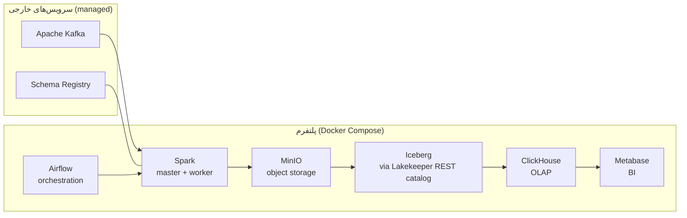

# معماری پلتفرم — Modern Data Analytics Platform

این سند معماری **پیاده‌سازی‌شده‌ی** پروژه را توصیف می‌کند: چه چیزی واقعاً در کد هست،
داده چطور از Kafka تا Metabase حرکت می‌کند، و هر لایه چه قراردادی (contract) دارد.

> این سند بر اساس خواندن مستقیم کد نوشته شده، نه صرفاً README. جایی که کد و مستندات
> اختلاف دارند، وضعیت واقعی کد ذکر شده است (بخش «اختلاف کد و مستندات»).

---

## ۱. نمای کلی

پروژه یک **Lakehouse** با معماری **Medallion** (برنز / نقره / طلا) است. هدف: دو جریان
دادهٔ ساختاراً متفاوت یک فروشگاه آنلاین را قابل‌اعتماد به یک انبار تحلیلی برساند:

- **دادهٔ تراکنشی** (transactional): سفارش، کاربر، محصول، قیمت — از سیستم عملیاتی.
- **دادهٔ رفتاری** (behavioral): clickstream، سبد خرید، جستجو، بازدید صفحه — از ردیابی تعامل کاربر.

هر دو جریان از Kafka وارد می‌شوند و در نهایت برای BI در ClickHouse می‌نشینند.

```
Kafka (خارجی)
   │
   ▼
Spark Structured Streaming ──► MinIO  ........ Bronze (Parquet خام)
   │
   ▼
Airflow (Batch ETL) + Spark ──► Iceberg on MinIO ...... Silver (تمیز، مدل‌شده، ACID)
   │
   ▼
Spark Batch ──► ClickHouse ............................. Gold (OBT برای OLAP)
   │
   ▼
Metabase .............................................. داشبورد BI
```

### چرا معماری Medallion؟

هر لایه یک کار دارد و مرز بین لایه‌ها همان چیزی است که پلتفرم را **قابل دیباگ** می‌کند:

| لایه | مسئولیت | تضمین |
|------|---------|-------|
| **Bronze** | حفظ چیزی که واقعاً رسید | هرگز dedup یا join یا مدل‌سازی نمی‌کند؛ رکورد دست‌نخوردهٔ منبع است |
| **Silver** | اعمال درستی | validation، cleaning، dedup، مدل ابعادی (Kimball) |
| **Gold** | سرعت کوئری | denormalize کردن Silver به ساختار بهینه برای BI |

جدا بودن لایه‌ها یعنی یک تغییر schema، یک deploy خراب، یا یک incident کیفیت داده در **یک لایه محصور**
می‌ماند و از لایهٔ زیرینش قابل بازسازی است.

---

## ۲. مرز سیستم‌ها

Kafka و Schema Registry **خارجی** هستند — پلتفرم به آن‌ها وصل می‌شود ولی آن‌ها را
راه‌اندازی نمی‌کند. هر چیزی از Spark به بعد توسط `docker-compose.yml` این ریپو provision می‌شود.



---

## ۳. جریان داده به‌تفکیک لایه

### Bronze — دو خط لولهٔ مستقل

Spark Structured Streaming میکروبچ‌های Kafka را می‌خواند، فیلدها را cast و normalize می‌کند،
و Parquet پارتیشن‌بندی‌شده روی MinIO می‌نویسد.

- **Bronze Transactional** — decode با Avro از Schema Registry، quarantine رکوردهای خراب.
- **Bronze Behavioral** — همان الگو برای ۱۰ نوع رویداد رفتاری.

قرارداد Bronze: **صحت منبع (source fidelity)**. هیچ dedup یا join انجام نمی‌شود؛ رکوردهایی که
decode نمی‌شوند drop نمی‌شوند بلکه با متادیتای validation نگه داشته می‌شوند (quarantine, not drop).

### Silver — Iceberg روی MinIO

لایهٔ Silver اولین لایه‌ای است که کوئری‌کردنش برای تحلیل امن است. با Apache Iceberg
(جداول ACID، نسخه‌دار، MERGE بی‌خطر) روی MinIO ساخته می‌شود و از طریق Lakekeeper REST catalog دسترسی می‌گیرد.

**دو دامنه، ایزوله از هم** (تیم‌های جدا، برای کار موازی بدون تداخل):

#### Silver Behavioral (کامل و orchestrate‌شده)

یک **star schema** با کلیدهای surrogate قطعی (deterministic). جداول در namespace `silver_behavioral`:

| جدول | نوع | grain (یک ردیف به‌ازای هر...) |
|------|-----|------------------------------|
| `fact_behavioral_events` | Fact | **یک رویداد رفتاری** (`event_key`) |
| `dim_behavioral_device` | Dimension | یک نوع device |
| `dim_behavioral_event_type` | Dimension | یک نوع رویداد (+ دسته‌بندی) |
| `dim_behavioral_session` | Dimension | یک session کاربر |
| `behavioral_events_quarantine` | Quarantine | رکورد مردود با خطای validation |
| `behavioral_pipeline_state` | State | یک اجرای pipeline در یک تاریخ |
| `behavioral_validation_issues` | Quality | یک issue کیفیت داده |

نکته: فیلدهای `product_id`, `order_id`, `user_id` روی خودِ `fact_behavioral_events` هستند
(از payload رویداد می‌آیند) — این نقطهٔ اتصال بالقوه به دامنهٔ تراکنشی است.

#### Silver Transactional

`silver_transactional_job.py` هر جدول Bronze را validate و clean می‌کند، سپس مدل کامل Kimball می‌سازد و روی Iceberg می‌نویسد:

| جدول | نوع | grain |
|------|-----|-------|
| `dim_date` | Dimension | یک روز تقویمی |
| `dim_user` | Dimension | یک کاربر |
| `dim_category` | Dimension | یک دسته محصول |
| `dim_product` | Dimension | یک محصول |
| `dim_product_price_scd` | Dimension (SCD) | یک بازهٔ قیمت محصول |
| `fact_order` | Fact | **یک سفارش** (`order_id`) |
| `fact_order_item` | Fact | **یک قلم سفارش** (order × product) |

> کلیدهای اتصال بین دو دامنه: `user_id` / `product_id` / `order_id`.

### Gold — ClickHouse OBT

فقط دامنهٔ **Behavioral** پیاده‌سازی شده است. جدول Silver ابعادی به یک
**One Big Table** به نام `lakehouse.behavioral_obt` در ClickHouse flatten می‌شود (جزئیات در `docs/GOLD_LAYER.fa.md`).

### Viz — Metabase

Metabase مستقیم به ClickHouse وصل می‌شود و روی `behavioral_obt` داشبورد می‌سازد.

---

## ۴. Orchestration

Airflow زمان‌بندی batch را مدیریت می‌کند. الگوی هر DAG: **اول upstream را چک کن، بعد Spark job را اجرا کن.**

- `silver_behavioral_dag.py` — اجرای Silver Behavioral
- `silver_transactional_dag.py` — اجرای Silver Transactional
- `gold_behavioral_dag.py` — بارگذاری Gold (`0 3 * * *` روزانه)؛ اول SUCCEEDED بودن Silver و ready بودن ClickHouse را چک می‌کند.

---

## ۵. Stack تکنولوژی

| لایه | تکنولوژی | نقش |
|------|----------|-----|
| Ingestion | Apache Kafka + Schema Registry (خارجی) | event bus + قرارداد schema |
| Processing | Apache Spark 3.5 (Structured Streaming + Batch) | ETL همهٔ لایه‌ها |
| Object storage | MinIO | Bronze، warehouse، checkpoint |
| Table format | Apache Iceberg + Lakekeeper REST catalog | جداول ACID لایهٔ Silver |
| OLAP | ClickHouse 24.8 | جدول Gold برای کوئری سریع |
| Orchestration | Apache Airflow 3.2 (CeleryExecutor + Redis) | زمان‌بندی batch |
| BI | Metabase | داشبورد |
| Infra | Docker Compose + Traefik | استقرار محلی / VPS |

---

## ۶. تصمیم‌های طراحی کلیدی

1. **دو خط لولهٔ ایزوله در Silver.** Behavioral و Transactional ماژول‌های جدا دارند تا دو تیم موازی کار کنند بدون merge conflict.
2. **کلیدهای surrogate قطعی.** با `sha2` روی natural keyها ساخته می‌شوند، پس یک entity در اجراهای مختلف همیشه به یک هویت تحلیلی map می‌شود (idempotency).
3. **Kafka و Schema Registry خارجی.** footprint استک Compose پایین می‌ماند.
4. **Quarantine به‌جای drop.** دادهٔ خراب قابل تشخیص می‌ماند.
5. **Gold فعلاً فقط Behavioral.** دامنهٔ تراکنشی تا زمانی که یک مدل مشترک صریحاً معرفی شود مستقل می‌ماند.

---

## ۷. اختلاف کد و مستندات (نکتهٔ مهم)

README می‌گوید Silver Transactional فقط «Parquet تمیز» تولید می‌کند و مدل Kimball ندارد.
اما کدِ فعلی (`src/jobs/silver_transactional_job.py:204` و `src/common/silver_transactional_kimball.py`)
**مدل کامل Kimball را می‌سازد و روی Iceberg می‌نویسد** (`build_all_kimball_tables` + `SilverTransactionalIcebergWriter.write_all`).

یعنی کد از مستندات جلوتر است. این برای بحث Gold مهم است: جداول ابعادی تراکنشی
(`fact_order`, `dim_user`, `dim_product`, ...) در عمل موجود‌اند و اگر بخواهیم می‌توان روی آن‌ها Gold ساخت.

> هشدارهای شناخته‌شده در README (بخش Engineering Notes) هنوز معتبرند: مثلاً Bronze
> رفتاری `event_id` تولیدکننده را با هش بازنویسی می‌کند، و job تراکنشی خطای هر جدول را
> می‌بلعد (try/except/continue) — این‌ها روی قابلیت اتکای Silver اثر دارند.

---

## ۸. وضعیت فعلی پیاده‌سازی

| بخش | وضعیت |
|-----|-------|
| Bronze Transactional | ✅ پیاده‌سازی‌شده |
| Bronze Behavioral | ✅ پیاده‌سازی‌شده |
| Silver Behavioral | ✅ کامل (star schema + MERGE + quarantine + DQ + DAG) |
| Silver Transactional | ✅ Kimball روی Iceberg (کد) — با هشدارهای اتکاپذیری |
| Gold Behavioral | ✅ OBT روی ClickHouse + DAG |
| Gold Transactional / cross-domain | ⛔ هنوز نه (تصمیم طراحی — بخش OBT) |
| Metabase dashboards | 🚧 در انتظار |
