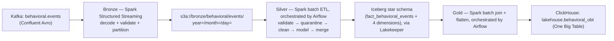
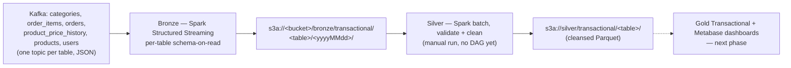

# Modern Data Analytics Platform — Technical Documentation

**A Kafka-to-Lakehouse Data Platform for E-Commerce Analytics**

Version 1.0 — August 2026
Tags: Medallion Architecture · Apache Spark · Apache Iceberg · Apache Airflow · ClickHouse

> This document is a faithful Markdown conversion of the project's original `ProjectDocumentation_ModernDataAnalyticsPlatform.pdf`. Content, terminology, and technical claims are preserved as written in that source; nothing has been added, removed, or altered.

---

## Table of Contents

1. [Problem Statement](#1-problem-statement)
2. [Introduction](#2-introduction)
3. [Architecture Overview](#3-architecture-overview)
4. [Infrastructure](#4-infrastructure)
5. [Bronze Layer](#5-bronze-layer)
6. [Silver Layer](#6-silver-layer)
7. [Silver Processing Workflow](#7-silver-processing-workflow)
8. [Gold Layer](#8-gold-layer)
9. [Streaming, Schema Management & Data Contracts](#9-streaming-schema-management--data-contracts)
10. [Data Quality & Validation](#10-data-quality--validation)
11. [Analytics & Reporting](#11-analytics--reporting)
12. [Technology Stack](#12-technology-stack)
13. [Configuration Management](#13-configuration-management)
14. [Challenges & Design Decisions](#14-challenges--design-decisions)
15. [Current Implementation Status & Roadmap](#15-current-implementation-status--roadmap)
16. [How to Run the Project](#16-how-to-run-the-project)

---

## 1. Problem Statement

### 1.1 Overview

Modern e-commerce systems produce two structurally different data streams: transactional data — orders, users, products, and pricing — generated by operational systems, and behavioral data — clickstream, search, cart, and checkout events — generated by user interaction tracking. Both streams need to land in a central lake reliably, with schema enforcement and full lineage, before they can be cleaned, modeled, and served to analytics consumers.

The Modern Data Analytics Platform is a Kafka-to-Lakehouse pipeline built to solve this problem. It ingests both streams from Kafka into an object-storage Bronze layer using Apache Spark Structured Streaming, refines them in a Silver layer built on Apache Iceberg, and — for the Behavioral domain — flattens the result into a ClickHouse Gold layer ready for analytical querying and dashboarding.

### 1.2 Data Sources

The platform processes two categories of source data, both delivered through Kafka rather than as flat files:

- **Transactional Data** — six structured business entities (categories, products, product price history, users, orders, order items), published as JSON messages, one Kafka topic per table.
- **Behavioral Data** — a single clickstream event topic (`behavioral.events`), published in Confluent Avro wire format with the schema resolved dynamically from a Schema Registry rather than hardcoded.

### 1.3 Project Objectives

- Build automated, schema-aware ingestion pipelines for both transactional and behavioral Kafka streams.
- Preserve an unmodified, append-only record of everything that arrives, so any downstream bug is recoverable without re-ingesting from Kafka.
- Validate, clean, and dimensionally model the data before it is trusted for analysis, without silently discarding usable records.
- Maintain a full audit and data-quality trail: every quarantined or flagged record must be traceable back to its exact Kafka message.
- Guarantee idempotency throughout, so that Airflow retries and manual backfills always converge to the same result.
- Serve a denormalized, query-optimized analytical layer suitable for business intelligence tooling.
- Orchestrate the entire pipeline with Apache Airflow and containerize the full stack with Docker Compose.

---

## 2. Introduction

Data-driven decision-making requires a platform capable of collecting data from multiple sources, processing it reliably, and making it available for analytical workloads without endangering the operational systems it depends on. This project implements that platform using a Medallion (Bronze / Silver / Gold) architecture, combining stream processing, batch ETL, a lakehouse table format, workflow orchestration, and OLAP-backed reporting into a single, coherent system.

Two independently owned pipelines run through the platform end to end: a Transactional pipeline covering six core e-commerce entities, and a Behavioral pipeline covering user interaction events. Both begin at Kafka — a managed dependency the platform connects to but does not provision — and both converge, at different levels of maturity, on the same layered lakehouse.

### 2.1 Main Components

| Component | Purpose |
|---|---|
| Apache Kafka | Streaming source for both data domains (externally managed) |
| Confluent-compatible Schema Registry | Live schema resolution for the Behavioral Avro stream (externally managed) |
| Apache Spark (Structured Streaming + Batch) | Bronze ingestion, Silver transformation, and Gold flattening |
| MinIO (S3-compatible) | Object storage for Bronze Parquet and the Iceberg warehouse |
| Apache Iceberg | Table format for the Silver Behavioral star schema |
| Lakekeeper | REST catalog resolving Iceberg tables by warehouse and namespace |
| Apache Airflow | Workflow orchestration for the Silver and Gold Behavioral pipelines |
| ClickHouse | Analytical OLAP store for the Gold Behavioral One Big Table |
| Metabase | Dashboarding and reporting layer (provisioned; dashboards are a roadmap item) |
| Docker Compose | Local and VPS infrastructure provisioning for the full stack |

### 2.2 Data Flow Overview

Each domain flows independently through Bronze and Silver before the Behavioral domain converges on a shared Gold layer.

> **Note on source diagrams:** the original PDF includes two infographic figures at this point — *Figure 1, "Data Flow Overview — Transactional and Behavioral pipelines through Bronze, Silver, and Gold"* and *Figure 2, "End-to-End Data Pipeline Architecture — Bronze, Silver, and Gold layers with orchestration and storage."* They are not reproducible pixel-for-pixel in Markdown, so equivalent Mermaid diagrams built from the same components are provided in [Section 3](#3-architecture-overview) instead. Both pipelines are designed around validation, lineage, and idempotent processing at every stage, so that reruns, retries, and backfills are always safe.

### 2.3 Expected Outcomes

By the end of the Behavioral pipeline, raw clickstream events become a single denormalized, analytics-ready table in ClickHouse, with a full quarantine and data-quality trail behind it. The Transactional pipeline currently produces validated, cleansed data ready for the next phase of dimensional modeling. Together they form a scalable, auditable foundation for business intelligence.

---

## 3. Architecture Overview

### 3.1 Overview

The platform follows a Medallion architecture: each layer has exactly one job, and the boundary between layers is what keeps the system debuggable. Bronze preserves what actually arrived. Silver decides what is true. Gold flattens what is true into a shape a BI tool can query without joins.

Because each layer is boundary-isolated from the next, a bug in one layer is fixed by changing code and re-running over the unchanged layer beneath it — a Silver bug never requires re-ingesting from Kafka, and a Gold bug never requires re-running Silver.

### 3.2 Architecture Components

- **Apache Kafka and Schema Registry** — externally managed streaming source and schema authority.
- **Apache Spark** — Structured Streaming for Bronze; batch ETL for Silver and Gold.
- **MinIO** — S3-compatible object storage underlying both Bronze Parquet and the Iceberg warehouse.
- **Apache Iceberg via Lakekeeper** — the Silver Behavioral table format and REST catalog.
- **Apache Airflow** — orchestration for the Silver Behavioral and Gold Behavioral DAGs.
- **ClickHouse** — the Gold Behavioral analytical store.
- **Metabase** — the intended dashboarding layer, provisioned ahead of its Gold Transactional dependency.

### 3.3 Data Flow

The Behavioral pipeline is the most complete path through the platform today:



The Transactional pipeline follows the same Bronze/Silver shape but currently stops short of Gold:



### 3.4 Architectural Principles

- Separation of operational (Bronze/Silver) and analytical (Gold) workloads.
- Independent processing of the Transactional and Behavioral domains — separate Bronze jobs, separate Silver modules, separate Spark sessions, no shared code between the two Silver pipelines.
- Per-table, per-dimension merge strategy rather than a single blanket write rule, so historical attributes such as first-seen timestamps are never silently overwritten.
- Two schema strategies applied deliberately: static, checked-in schemas for the stable Transactional topics; schemas fetched live from the Schema Registry for the Behavioral stream, which is the actual source of truth for that contract.
- Idempotency treated as a design constraint, not a feature — every Silver Behavioral and Gold Behavioral write is a MERGE or partition-replace on a deterministic key, so Airflow retries and backfills always converge to the same state.
- Infrastructure provisioned ahead of code, following a phased build order (Bronze, then Silver, then Gold/visualization), so each phase's services are already available when that phase's code is written.

---

## 4. Infrastructure

All platform components are deployed and managed using Docker Compose. Containerization provides a consistent, reproducible, and isolated environment for every service in the stack, both for local development and for VPS deployment behind a reverse proxy.

### 4.1 Services

**Workflow Orchestration**
- Airflow API Server
- Airflow Scheduler
- Airflow Worker (Celery)
- Airflow Triggerer
- Airflow DAG Processor
- Airflow Init
- Redis (Celery broker)

**Stream & Batch Processing**
- Spark Master
- Spark Worker

**Storage & Table Format**
- MinIO — S3-compatible object storage (Bronze Parquet, Silver Parquet, Iceberg warehouse)
- Lakekeeper — Iceberg REST catalog used by the Silver Behavioral pipeline, backed by its own Postgres metadata database
- Iceberg REST catalog (tabulario) — provisioned as an alternate catalog, not targeted by the pipeline environment
- PostgreSQL — Airflow metadata database

**Analytics & Reporting**
- ClickHouse — Gold Behavioral OLAP store
- Metabase — dashboarding layer, with its own Postgres metadata database

**Networking**
- Traefik — reverse proxy for VPS/domain routing (external network)

---

## 5. Bronze Layer

### 5.1 Purpose

The Bronze layer lands raw events from Kafka into MinIO as Parquet, with minimal, well-defined transformations: schema parsing or decoding, basic standardization, lineage metadata, and date partitioning. Bronze intentionally never deduplicates, joins, or models data — that responsibility belongs entirely to Silver. This means Bronze can stay a fast, append-only stream with no business logic in its hot path, and it remains the unmodified record of what actually arrived even if a downstream layer has a bug.

- Consume Kafka topics via Spark Structured Streaming.
- Parse or decode the wire format (JSON for Transactional, Confluent Avro for Behavioral) against a known schema.
- Attach ingestion lineage — source topic, partition, offset, broker timestamp, and ingestion time.
- Partition output by date for efficient downstream reads.
- Write append-only, Snappy-compressed Parquet with streaming checkpoints for exactly-once micro-batch semantics.

### 5.2 Bronze Transactional Pipeline

Ingests six core e-commerce entities from Kafka, one topic per table, using statically defined schemas.

| Table | Partition Source Column |
|---|---|
| orders | event_timestamp (derived from timestamp) |
| product_price_history | valid_from_timestamp (derived from valid_from) |
| users | signup_date |
| categories | Kafka broker timestamp (fallback) |
| order_items | Kafka broker timestamp (fallback) |
| products | Kafka broker timestamp (fallback) |

Because not every topic carries a reliable business timestamp, the partition date is derived per table, falling back to the Kafka broker's own timestamp so records never land in a null partition. Nullable Avro-style union fields (such as `loyalty_tier`, `location`, and `parent_category_id`) are flattened into plain nullable string columns during the transform.

### 5.3 Bronze Behavioral Pipeline

Ingests the single `behavioral.events` topic, encoded in Confluent Avro wire format, with the schema resolved dynamically from the Schema Registry rather than hardcoded.

**Design Highlights**

- **Confluent wire-format decoding:** each Kafka message is decoded by stripping the magic byte and four-byte schema id before Avro-decoding the payload in permissive mode.
- **Quarantine, not drop:** records that fail to decode, or whose wire-format schema id does not match the schema fetched from the registry, are kept — with `decode_success`, `schema_id_matches`, `decode_error`, `validation_errors`, and `is_valid` columns populated — so Silver can route them to quarantine instead of the stream failing outright.
- **Partition fallback:** year, month, and day are derived from the parsed event timestamp when possible, falling back to the Kafka broker's own timestamp.
- **Derived event_id:** the transform computes a SHA-256 hash of the Kafka topic, partition, and offset as the record's `event_id`, guaranteeing it is unique and non-null by construction for every record that reaches Silver.

---

## 6. Silver Layer

### 6.1 Purpose

Bronze answers "what arrived?". Silver answers "what is true?". Silver is where the platform decides what is trustworthy, makes it uniform, and models it dimensionally — it is the first layer that is safe to query for analysis. Because Silver never mutates Bronze, a validation-rule bug or a bad merge is fixed by changing code and re-running Silver over unchanged Bronze data, with no re-ingestion from Kafka required.

| Problem in Bronze | Silver's Answer |
|---|---|
| Duplicate events from streaming retries and backfills | Deduplication on a deterministic event_key |
| Mixed casing, blank strings, placeholder values | Normalization and null-like collapsing |
| Broken records mixed in with good ones | Three-way split: valid / warning / rejected |
| No dimensional structure; wide raw rows | Kimball star schema (facts and dimensions) |
| No way to measure data quality | Dedicated quality and audit tables |
| Reruns would double-count records | Idempotent MERGE on natural keys |

The Silver layer contains two independently owned pipelines, structurally isolated with no shared module, Spark session, or cross-imports — a deliberate choice that lets the Behavioral and Transactional teams work in parallel without merge conflicts.

| | Silver Behavioral | Silver Transactional |
|---|---|---|
| Status | Complete | Partial |
| Output format | Apache Iceberg | Parquet |
| Catalog | Lakekeeper REST | None |
| Dimensional model | Yes (star schema) | Not yet |
| Orchestrated | Yes (Airflow DAG) | No DAG yet (manual run) |
| Idempotent | Yes (MERGE) | No (overwrite) |
| Quality tables | Yes | Partially implemented |

### 6.2 Silver Behavioral Pipeline

Reads one day of Bronze behavioral Parquet and produces a full Iceberg star schema through the Lakekeeper REST catalog. The pipeline is split into nine single-responsibility modules — configuration, Spark session, schema/DDL, Bronze reader, validation, cleaning, transform, Iceberg writer, and quality writer — each owning one decision that must be testable and changeable in isolation.

**The event_key Contract**

The fact grain is one row per unique behavioral event, keyed on `event_key`, derived in order of preference: the record's own `event_id` when present and non-blank, otherwise a SHA-256 hash of the Kafka topic, partition, and offset. The topic is included deliberately, since a Kafka offset is only unique within a topic partition. Records with neither a usable `event_id` nor usable Kafka coordinates are rejected outright rather than silently assigned a key.

**Merge Strategies**

Different tables require different write semantics. A blanket "update all columns on match" rule would be actively harmful for a dimension table's first-seen timestamp, since that value is computed as the current batch's minimum — an unconditional overwrite would destroy the true first sighting on every run.

| Strategy | Used By | Behavior |
|---|---|---|
| Deduplicate Insert | fact_behavioral_events | Insert-only on event_key; events are immutable, reruns are no-ops |
| Upsert, Preserve First-Seen | dim_device, dim_event_type, dim_session, data-quality table | first_seen := least(stored, incoming); last_seen := greatest(stored, incoming) |
| Insert Only | dim_date, quarantine table | Insert new keys only; never rewrite existing rows |
| Upsert All | pipeline run/audit table | Full overwrite of the matched run row |

**Idempotency**

Every write is a MERGE on a deterministic key, so re-running the same partition, an Airflow retry, and a backfill all converge to the same result: the fact table is insert-only on `event_key`; dimensions upsert on their natural key while preserving first-seen; the quarantine table is insert-only; the quality table upserts on a deterministic hash of source, event, issue type, and date; and the audit table upserts on a run id that is deterministic per processing date.

**Outputs**

| Table | Namespace | Grain |
|---|---|---|
| fact_behavioral_events | silver | One behavioral event |
| dim_behavioral_session | silver | One session |
| dim_behavioral_device | silver | One device type |
| dim_behavioral_event_type | silver | One event type and category |
| dim_date | silver | One calendar day (shared conformed dimension) |
| behavioral_events_quarantine | silver | One rejected event |
| behavioral_validation_issues | silver_quality | One (record, issue) pair |
| behavioral_pipeline_state | silver_quality | One pipeline run |

### 6.3 Silver Transactional Pipeline

Reads Bronze transactional Parquet per table, validates it, cleans it, and writes cleansed Parquet — the first stage toward a full dimensional model for the domain.

**Implemented**

- A Bronze reader that reads one table's Bronze Parquet with source-file lineage.
- Per-table required-field, type, and range validation, returning valid, rejected, and quality-issue result sets, with timestamp repair.
- Cleaning: trimming, null-like collapsing, type casting, and exact-duplicate removal on the natural record id.
- A quality writer that records validation issues to an Iceberg table.
- A job entrypoint that loops all six tables: read, validate, write quality issues, clean, and write Parquet.

**Planned for the Next Phase**

- Iceberg output in place of overwrite-mode Parquet, enabling idempotent, incremental processing.
- A Kimball dimensional model — dim_user, dim_product, dim_category, fact_order, fact_order_item — with SCD Type 2 for product price history.
- An Airflow DAG bringing orchestration parity with the Behavioral pipeline.

---

## 7. Silver Processing Workflow

The Silver Behavioral job follows a fixed, thirteen-step sequence for every processing date:

1. Create the Spark session and validate runtime configuration — the job fails fast if MinIO credentials or URLs are missing.
2. Ensure namespaces and tables exist, applying additive schema evolution for any column missing from an already-deployed table.
3. Read the Bronze partition for the processing date, attaching `bronze_file_path` lineage. An empty partition ends the run as `SUCCESS_EMPTY`, not a failure.
4. Validate: derive `event_key`, carry Bronze's own errors forward with a `bronze:` prefix, apply Silver's error and warning rules, and split into valid, warning, and rejected sets.
5. Quarantine rejected records via an insert-only MERGE.
6. Write quality findings for every error and warning.
7. Clean the processable records (valid plus warning) and deduplicate on `event_key`.
8. Merge lookup dimensions — device and event type — preserving `first_seen_at`.
9. Merge the fact table, insert-only on `event_key`.
10. Recompute the session dimension from the fact table for touched sessions only, then merge.
11. Run data-quality assertions against the written partition; any breach raises and fails the task.
12. Record the run in the pipeline-state table with counts and status.
13. Stop the Spark session in a `finally` block, regardless of outcome.

On failure, the run is recorded as `FAILED` with the error message, and the original exception is re-raised so the job exits non-zero and Airflow marks the task failed — nothing is swallowed silently.

---

## 8. Gold Layer

### 8.1 Purpose

Silver answers "what is true?" in a normalized, storage-optimized star schema. Gold answers "what is fast to query?" in a denormalized, read-optimized table. Gold does no validation and no cleaning — Silver already guaranteed correctness — its one job is to flatten and serve: read the conformed facts and dimensions, join them, and land one wide row per grain in an OLAP engine tuned for wide scans and aggregation.

Keeping Gold separate from Silver means the normalized source of truth never changes shape to suit a report; reshaping the analytical table is a Gold rebuild over unchanged Silver Iceberg tables, and Gold reads are fully decoupled from the write path — rebuilding a day of Gold never touches Silver, Bronze, or Kafka.

### 8.2 Gold Behavioral Pipeline

Reads the Silver Behavioral Iceberg star for one processing date and loads a denormalized One Big Table into ClickHouse.

**The OBT Design**

The transform reads one day of the fact table, filtered on `processing_date`, and left-joins three lookup dimensions to overlay descriptive attributes:

| Silver Source | Contributes |
|---|---|
| fact_behavioral_events | Grain, measures, keys, lineage |
| dim_behavioral_device | Device name |
| dim_behavioral_event_type | Event category |
| dim_behavioral_session | Session start/end, duration, primary device, event count |

The result is one denormalized row per event. Nested fact columns — cart items and data-quality flags — are serialized to JSON strings, since the OBT is a flat table, and a `gold_loaded_at` timestamp is stamped at load time.

**The Column Contract**

A single canonical column list defines the OBT's 52 columns, in the exact order the ClickHouse DDL expects. The transform, the DDL, the writer, and a pre-write contract assertion all reference this one list, so a malformed batch is rejected before it ever reaches ClickHouse — the assertion also rejects the batch if any key column is null or if `event_key` is duplicated.

**Idempotency**

The target table is a ClickHouse ReplacingMergeTree engine partitioned by `processing_date`. Reloading a date is a partition drop followed by a bulk insert of that day's rows, so an Airflow retry or a manual re-run converges to the same result rather than appending duplicates. After the insert, the writer verifies the loaded row count against the source row count and raises on any mismatch.

**Processing Workflow**

1. Build configuration from the environment, resolving both the ClickHouse target and the Silver Iceberg table paths.
2. Create the Spark session, reusing the Silver Behavioral session factory.
3. Build the OBT — read the fact partition, left-join the three dimensions, project the canonical column list, and cache.
4. Assert the contract — column order, non-null key columns, and `event_key` uniqueness.
5. Replace the partition — ensure the database and table exist, drop the date's partition, bulk-insert, and verify the loaded row count.
6. Stop the Spark session and release cached memory in a `finally` block.

> **Note on source diagram:** the original PDF captions the diagram at this point as *"Figure 6. Gold Behavioral Pipeline — Silver Iceberg join and flatten into the ClickHouse One Big Table,"* but the embedded image is identical to the Bronze ingestion diagram shown earlier in the document (Figure 1) rather than a distinct Gold-specific figure. This appears to be a duplication in the source PDF itself; it is noted here rather than silently corrected or guessed at.

**Outputs**

| Table | Database | Engine | Grain |
|---|---|---|---|
| behavioral_obt | lakehouse | ReplacingMergeTree(gold_loaded_at), partitioned by processing_date | One behavioral event |

The sort key is `(processing_date, event_category, event_type, user_key, session_key, event_key)`, chosen for the category/funnel and per-user/session rollups that reporting queries rely on.

**Verification**

The pipeline has been run and verified end to end against a full production-shaped day of data, loading over 374,000 rows into the ClickHouse One Big Table, with row counts and category/device/attribution rollups confirmed through a dedicated verification query set.

---

## 9. Streaming, Schema Management & Data Contracts

### 9.1 Why Kafka and Schema Registry

Kafka and the Schema Registry are treated as externally managed dependencies that the platform connects to, not services it provisions. This keeps the Docker Compose footprint focused on the layers the team actually owns, and avoids duplicating infrastructure the platform does not control.

Kafka sits between the source systems and the Bronze layer as a decoupling boundary: producers and the Bronze consumers evolve independently, and the platform can replay a topic from any retained offset without touching the source systems.

### 9.2 Topic Organization

| Domain | Topic(s) | Wire Format |
|---|---|---|
| Transactional | categories, order_items, orders, product_price_history, products, users | JSON, one topic per table |
| Behavioral | behavioral.events | Confluent Avro, single unified event topic |

### 9.3 Schema Strategy

The platform deliberately applies two different schema strategies, matched to how stable each contract actually is:

- **Transactional — static, checked-in schemas:** each of the six tables is parsed against a statically defined PySpark StructType, because these topics are internally defined and stable.
- **Behavioral — live Schema Registry lookup:** the Avro schema and its id are always fetched live from the Schema Registry rather than checked in, because the registry — not a local copy — is the source of truth for that contract. Each message is decoded by stripping the Confluent magic byte and four-byte schema id before Avro-decoding the payload.

### 9.4 Bronze-to-Silver Contract: Behavioral

The Silver Bronze reader fails the job outright if any lineage column is missing from the Bronze output — a record that cannot be traced back to its exact Kafka message is not acceptable input to Silver. Selected columns from the contract:

| Column | Description | Required by Silver |
|---|---|---|
| event_id | SHA-256 of topic, partition, and offset | Preferred key source |
| session_id | Session identifier | Yes |
| event_type | e.g. page_view, add_to_cart, search_product | Yes |
| event_timestamp | Parsed event time | Yes |
| user_id | User identifier; null for anonymous traffic | No — warning if absent |
| device_type | Raw device string | No — warning if absent or unknown |
| ip_address | Client IP | No — warning if malformed |
| kafka_topic / partition / offset / timestamp | Lineage; key fallback components | Yes — reader fails if absent |
| is_valid, validation_errors | Bronze's own validation verdict | Carried forward, not authoritative |

### 9.5 Silver Behavioral Output Contract

`fact_behavioral_events` carries 34 columns across four groups: the grain and merge key (event_key, event_id, date_key), natural dimension keys (user_id, session_id, device, event_type), business measures (quantity, cart_value, duration_sec, rating, http_status, results_count, and others), and lineage/audit columns (Kafka coordinates, Bronze file path, pipeline run id, and Silver ingestion timestamp).

---

## 10. Data Quality & Validation

### 10.1 Overview

Data quality is enforced at every stage of the pipeline before data reaches the analytical layer, following a consistent principle throughout the platform: reject only what cannot be modeled, and keep everything else — flagged, not silently dropped.

### 10.2 Bronze-Level Validation

The Behavioral transform attaches `decode_success`, `schema_id_matches`, `decode_error`, `validation_errors`, and `is_valid` to every record. Nothing is dropped at Bronze — a decode failure is quarantined by Silver, not discarded by the stream.

### 10.3 Silver Behavioral: Three Severities

| Severity | Meaning | Destination |
|---|---|---|
| Error | Cannot be modeled | Quarantine; excluded from the fact table |
| Warning | Usable but suspicious | Kept; flows into the fact table with dq_flags |
| Clean | No findings | Fact table |

**Error Rules (Reject)**

- No reliable unique key — event_key cannot be derived.
- Missing session_id, event_type, or event_timestamp.
- Unparseable source timestamp.
- Avro decode failure at Bronze.
- Any Bronze-level error, carried forward with a `bronze:` prefix.

**Warning Rules (Keep and Flag)**

- Missing anonymous user id — anonymous traffic is expected, not broken.
- Missing UTM source, missing or unknown device type.
- Invalid IP address format — the raw value is retained, so the flag stays actionable.
- Business anomalies: negative cart value, non-positive quantity, negative duration/results/clicked-position/text-length, rating outside 1–5, HTTP status outside 100–599.

Bronze treats a missing user id or device type as fatal; Silver deliberately downgrades both to warnings, because rejecting anonymous traffic would understate every funnel metric the platform needs to produce.

### 10.4 Cleaning Rules

- **Identity fields** (event_key, event_id, session_id, event_type, device) are trimmed only, never collapsed to null — a null key can never match a MERGE condition.
- **Descriptive fields** are trimmed, with blank, null-like, and placeholder values ("n/a", "unknown", "-", etc.) collapsed to null.
- **Casing** is normalized to lowercase for event_type, device, payment_type, shipping_method, fulfillment_speed, and UTM source.
- **Type casting** uses a safe cast that yields null rather than failing the job.
- **Deduplication** uses a row-number window over event_key ordered by ingestion timestamp and Kafka offset, keeping the earliest copy — deterministic across runs.

### 10.5 Post-Write Assertions

After the fact table MERGE, the job asserts against the written partition: no null event_key, no duplicate event_key within the partition, no null date_key, and a fact row count equal to the clean event count. Any breach raises and fails the task.

### 10.6 Gold Contract Assertions

Before any ClickHouse write, the Gold job asserts that the DataFrame's columns exactly match the canonical column list in order, that no key column is null anywhere in the batch, and that no event_key appears more than once. Separately, the partition-replace step verifies the ClickHouse-loaded row count against the source row count and raises on any mismatch.

### 10.7 Silver Transactional Validation

Per-table validation returns valid, rejected, and quality-issue result sets, with required-field, type, and range rules plus timestamp repair. Rejected records are excluded from the cleaned output.

**Key Benefits**

- A single, consistent principle across every layer: reject only what cannot be modeled.
- Full traceability — every quarantined or flagged record retains its Kafka coordinates and Bronze file path.
- Idempotent quality and audit tables, so re-running a date never inflates quality metrics.
- Contract assertions that fail the pipeline before a malformed batch reaches ClickHouse, rather than after.

---

## 11. Analytics & Reporting

### 11.1 Overview

ClickHouse serves as the platform's analytical layer, purpose-built to turn the Silver Behavioral star schema into a queryable dataset optimized for reporting. While MinIO and Iceberg hold the normalized, storage-optimized Silver tables, ClickHouse holds one wide, denormalized, column-oriented table tuned for the aggregations and filters a reporting workload actually runs.

### 11.2 Data Ingestion Strategy

Rather than streaming continuously from Kafka a second time, Gold reads directly from the Silver Iceberg tables that Kafka already fed once, correctly, at the Bronze layer:

```text
Silver Iceberg (fact_behavioral_events + 3 dimensions)
        |
        v
Spark batch job  --  left-join dimensions, project 52 canonical columns
        |
        v
Contract assertion  --  columns, non-null keys, unique event_key
        |
        v
ClickHouse  --  DROP PARTITION + bulk insert + row-count verification
        |
        v
lakehouse.behavioral_obt  (ReplacingMergeTree, partitioned by day)
```

This keeps the Gold rebuild fully decoupled from the streaming path: reloading a day of Gold never touches Kafka, Bronze, or the streaming checkpoints.

### 11.3 Report Categories

**Behavioral Analytics (available today)**

- Search behavior and product discovery patterns.
- Cart and checkout funnel analysis, including abandonment.
- Session-level engagement — duration, event count, primary device.
- Acquisition-channel attribution via UTM source.

**Business Performance (planned, pending Gold Transactional)**

- Revenue analysis and trends by product and category.
- Order volume and fulfilment tracking.
- Customer loyalty-tier and purchasing-behavior analysis.

### 11.4 Dashboarding with Metabase

Metabase and its metadata database are provisioned as part of the Docker Compose stack, ahead of the code that will feed them — consistent with the platform's phased build order. Connecting Metabase to the ClickHouse `behavioral_obt` table and building the first funnel and engagement dashboards is the next milestone on the roadmap (see [Section 15](#15-current-implementation-status--roadmap)), to be followed by cross-domain dashboards once Gold Transactional exists.

**Key Benefits**

- A centralized, denormalized reporting layer built on ClickHouse, decoupled from operational systems.
- Fast aggregations over large event volumes via a column-oriented engine.
- A verified, idempotent load path — a Gold rerun always converges to the same table state.
- Infrastructure for BI already in place, so dashboard work can begin immediately once queries are defined.

---

## 12. Technology Stack

| Category | Technology | Status |
|---|---|---|
| Streaming ingestion | Apache Kafka | External, not provisioned by this repository |
| Schema management | Confluent-compatible Schema Registry | External; consumed by the Behavioral pipeline |
| Stream processing | Apache Spark 3.5.3 (Structured Streaming) | Implemented |
| Batch processing | Apache Spark 3.5.3 (batch ETL) | Implemented (Silver, Gold Behavioral) |
| Object storage | MinIO (S3-compatible), Parquet + Snappy | Implemented |
| Table format | Apache Iceberg | Implemented (Silver Behavioral) |
| Iceberg catalog | Lakekeeper (REST) | Implemented |
| Orchestration | Apache Airflow 3.2.1 (Celery, Postgres, Redis) | Implemented (Silver + Gold Behavioral DAGs) |
| Language / runtime | Python (PySpark) | Implemented |
| Local / VPS infrastructure | Docker Compose | Implemented |
| OLAP engine | ClickHouse | Implemented (Gold Behavioral OBT), verified end-to-end |
| ClickHouse client | clickhouse-connect (Python) | Implemented |
| BI / visualization | Metabase | Provisioned; dashboards are the next milestone |
| Reverse proxy | Traefik | Provisioned for VPS deployment |

**Spark Package Dependencies**

The Silver Behavioral package list — Iceberg Spark runtime, the Iceberg AWS bundle, Hadoop AWS, and the AWS Java SDK bundle — is defined once and imported by the job, the Airflow DAG, and the migration job alike, so a manual run and an Airflow-triggered run always resolve the same dependency versions. Kafka and Avro packages are intentionally absent from this list, since Silver is a batch job over Parquet and never touches Kafka directly. Gold Behavioral reuses this same package list unchanged, since it reads the same Iceberg-over-MinIO tables; its ClickHouse write path is pure Python via the clickhouse-connect driver and needs no additional Spark package.

---

## 13. Configuration Management

All configuration is environment-variable driven; no secrets or endpoints are hardcoded in application code. The Bronze pipelines validate required variables with a fail-fast helper, and the Silver Behavioral pipeline validates runtime configuration before any Spark action runs, raising immediately if MinIO credentials or URLs are missing or malformed.

### 13.1 Bronze Configuration

| Variable | Required | Used By |
|---|---|---|
| KAFKA_BOOTSTRAP_SERVERS | Yes | Kafka Reader |
| MINIO_BUCKET | Yes | MinIO Writer |
| SCHEMA_REGISTRY_URL | Yes | Registry Client (Behavioral) |
| MINIO_ROOT_USER / MINIO_ROOT_PASSWORD | Yes | Spark Session |
| SPARK_MASTER_URL | No — defaults to spark://spark-master:7077 | Spark Session |

### 13.2 Silver Behavioral Configuration

| Variable | Default | Purpose |
|---|---|---|
| ICEBERG_CATALOG_NAME | lakekeeper | Spark catalog alias |
| ICEBERG_REST_URI | http://lakekeeper:8181/catalog | REST catalog endpoint |
| BEHAVIORAL_ICEBERG_WAREHOUSE | warehouse | Lakekeeper warehouse name |
| BEHAVIORAL_ICEBERG_NAMESPACE | silver | Star-schema namespace |
| BEHAVIORAL_QUALITY_NAMESPACE | silver_quality | Quality/audit namespace |
| MINIO_ACCESS_KEY / MINIO_SECRET_KEY | fall back to MinIO root credentials | S3A credentials (required) |

Lakekeeper resolves a warehouse by name, not by URI; the configuration module normalizes a URI-shaped value to its name component defensively, and the Airflow DAG additionally passes the warehouse name explicitly.

### 13.3 Gold Behavioral Configuration

| Variable | Default | Purpose |
|---|---|---|
| CLICKHOUSE_HOST | clickhouse | Host reachable from the Spark driver / Airflow worker |
| CLICKHOUSE_HTTP_PORT | 8123 | HTTP interface used by clickhouse-connect |
| CLICKHOUSE_DB | lakehouse | Target database, auto-created by the writer |
| GOLD_BEHAVIORAL_TABLE | behavioral_obt | Target table name |

ClickHouse settings are validated at construction time, so a bad host or port fails at DAG-parse or job-start rather than after a Spark session has already spun up.

### 13.4 Secrets Management

Infrastructure topology — ports, image versions, hostnames — lives in the Docker Compose file; a separate environment file holds only credentials (Airflow, Postgres, MinIO, ClickHouse, Metabase), is git-ignored, and is never committed. Only a placeholder template is tracked in version control.

---

## 14. Challenges & Design Decisions

Building a lakehouse platform involves far more than connecting technologies together. The sections below document the most significant architectural decisions made throughout the build, and the reasoning behind each.

**Challenge 1: Managing Two Domains With Fundamentally Different Data**

The platform processes two structurally different streams — structured Transactional JSON and semi-structured Behavioral Avro events — differing in wire format, schema strategy, shape, and grain.

*Design Decision:* separate ingestion paths were implemented all the way down — separate Bronze jobs, separate Silver modules, separate Spark sessions, and no shared code between the two Silver pipelines. Isolation costs some duplication but buys independent deployability: a change owned by one domain's team cannot break the other's pipeline.

**Challenge 2: Preventing Duplicate Processing**

Because pipelines are re-run on a schedule and retried on failure, a key challenge was ensuring data is never processed more than once — duplicate processing would mean duplicate records, incorrect analytics, and wasted compute.

*Design Decision:* idempotency was treated as a design constraint from the start. Every Silver Behavioral and Gold Behavioral write is a MERGE, or a partition-replace, on a deterministic key — including the quality and audit tables. This is why the pipeline run id is derived from the processing date rather than a timestamp or random id: a retry must overwrite its own audit row, not append a new one.

**Challenge 3: Data Validation Without Losing Signal**

Raw events may contain missing fields, malformed values, and business anomalies. Rejecting anything imperfect would understate real activity — anonymous users and unknown devices are legitimate traffic, not broken records.

*Design Decision:* a three-way severity split — error, warning, clean — was introduced. Only records that genuinely cannot be modeled are quarantined; everything else is kept, flagged with data-quality flags, and simultaneously logged to a quality table, so nothing is both lost and invisible.

**Challenge 4: Decoupling Operational and Analytical Workloads**

Running analytical queries directly against operational storage does not scale and risks degrading the write path that Bronze and Silver depend on.

*Design Decision:* a full Medallion separation was adopted, with Gold as a distinct, denormalized layer in ClickHouse fed by a batch flatten of Silver — never a live query against the Iceberg tables Silver writes to.

**Challenge 5: Schema Management Across Two Contracts**

Producers and consumers must agree on message structure, but the two domains have very different stability profiles.

*Design Decision:* static, checked-in schemas were used for the stable Transactional topics, while Behavioral schemas are always fetched live from the Schema Registry, never checked in — because the registry, not a local copy, is the actual source of truth for that contract.

**Challenge 6: Choosing the Right Storage and Table Technologies**

A single storage technology is rarely optimal for every workload; the platform needed both a lakehouse table format for correctness and an OLAP engine for query speed.

| Layer | Technology | Chosen For |
|---|---|---|
| Bronze | MinIO + Parquet | Cheap, append-only object storage with columnar read efficiency |
| Silver (Behavioral) | Apache Iceberg via Lakekeeper | ACID merges, schema evolution, and a real dimensional model |
| Gold (Behavioral) | ClickHouse | Column-oriented storage tuned for wide scans and aggregation |

**Challenge 7: Workflow Automation**

Manually running ingestion, validation, and publishing steps in the correct order does not scale as the number of pipelines grows.

*Design Decision:* Apache Airflow orchestrates the Silver Behavioral and Gold Behavioral pipelines end to end, with retries, timeouts, and a single-active-run guarantee per DAG, and the Gold DAG waits on its upstream Silver DAG before submitting.

**Lessons Learned**

- Data quality should be enforced as early in the pipeline as possible.
- Idempotent, deterministic keys are what actually make incremental processing reliable — not just a schedule.
- Different workloads genuinely need different storage technologies; forcing one engine to serve every stage adds friction, not simplicity.
- Decoupling domains and layers through clear boundaries — Bronze/Silver/Gold, Behavioral/Transactional — lets teams move independently without constant coordination.
- Provisioning infrastructure ahead of the code that will use it keeps a phased build order honest and prevents late-stage infrastructure surprises.

**Conclusion**

The architecture reflects a series of decisions aimed at building a reliable, maintainable, and auditable lakehouse platform. The Behavioral domain — Bronze through Gold — is complete and has been verified end to end against real data volumes; the Transactional domain currently reaches validated, cleansed Silver output, with dimensional modeling and its own Gold layer next on the roadmap. The challenges encountered and the decisions made throughout closely mirror what a production data engineering team would face at this scale.

---

## 15. Current Implementation Status & Roadmap

### 15.1 Status by Layer

| Layer | Status | Description |
|---|---|---|
| Bronze | Implemented | Kafka to MinIO Parquet, both domains, with schema enforcement and full lineage |
| Silver — Behavioral | Implemented | Iceberg star schema, idempotent MERGE, quarantine, quality and audit tables, Airflow DAG |
| Silver — Transactional | Partial | Validated and cleansed Parquet; no Iceberg tables, no dimensional model, no DAG yet |
| Gold — Behavioral | Implemented, verified end-to-end | ClickHouse One Big Table, loaded and verified against a full production-shaped day |
| Gold — Transactional / Metabase dashboards | Planned | Infrastructure provisioned; next phase of work |

### 15.2 Implemented Today

- Bronze Transactional ingestion for six tables with static schema-on-read and per-table date partitioning.
- Bronze Behavioral ingestion with Confluent Avro decoding, live Schema Registry lookup, and quarantine-not-drop validation.
- Per-pipeline Spark session bootstrapping with MinIO/S3A configuration, plus checkpointed writers with small-file mitigation on the Behavioral side.
- A reusable Schema Registry client, designed for reuse across future Avro-backed streams.
- Silver Behavioral: Iceberg star schema over Lakekeeper, deterministic event_key, three-way validation, quarantine, per-table merge strategies, current-state quality table, audit/metrics table, additive schema evolution, post-write assertions, and a local test suite.
- Silver Transactional: Bronze reader, per-table validation with timestamp repair, cleaning, and cleansed Parquet output.
- Gold Behavioral: Silver-to-OBT transform, ClickHouse DDL with idempotent partition reload, contract assertions, and an Airflow DAG — verified with an end-to-end run loading 374,267 rows for a single day.
- Airflow DAGs for both Silver Behavioral and Gold Behavioral, with retries, timeouts, and a single-active-run guarantee.
- Environment-based configuration with fail-fast validation throughout.
- The full base infrastructure via Docker Compose, with automatic warehouse and bronze bucket creation.

### 15.3 Roadmap

Ordered by dependency, not by priority:

1. Silver Transactional dimensional model — dim_user, dim_product, dim_category, fact_order, fact_order_item, with SCD Type 2 for product price history. This unblocks cross-domain Gold reporting.
2. Silver Transactional hardening — Iceberg output, idempotent MERGE in place of overwrite, and an Airflow DAG for orchestration parity with Behavioral.
3. Gold Transactional and cross-domain Gold — denormalized tables joining Behavioral and Transactional once the Transactional star schema exists.
4. Metabase dashboards — funnel analysis, engagement and attribution reporting today; revenue, loyalty-tier, and return-rate reporting once Gold Transactional lands.
5. Expanded automated test coverage for the Silver and Gold Behavioral pipelines, and CI integration.
6. Near-real-time monitoring — a Kafka-based health dashboard covering ingestion rate, funnel ratios, and error rates.
7. Operational cleanup — consolidating to a single Iceberg catalog service and introducing Compose profiles so only the services a given phase needs are started.

---

## 16. How to Run the Project

### 16.1 Prerequisites

- Docker and Docker Compose.
- Python 3.9+ (only needed to run code or tests outside the containers).
- Java 8, 11, or 17 for local Spark runs.
- Network access to an externally managed Kafka cluster and Schema Registry.

### 16.2 Step 1 — Clone and Configure

```bash
git clone <repository-url>
cd modern_data_analytics_platform
cp .env.example .env
# edit .env with real credentials
```

### 16.3 Step 2 — Start the Infrastructure

```bash
docker compose up -d
docker compose ps
```

This brings up Postgres, Redis, Airflow, Spark (master and worker), MinIO, both Iceberg catalog services, ClickHouse, and Metabase. Kafka is not part of this stack — confirm reachability separately before proceeding.

### 16.4 Step 3 — Provision Buckets

The warehouse and bronze buckets are created automatically on startup. The checkpoints and silver buckets must be created manually:

```bash
docker compose exec minio mc alias set local http://minio:9000 <user> <password>
docker compose exec minio mc mb --ignore-existing local/checkpoints local/silver
```

### 16.5 Step 4 — Run Bronze Ingestion

Both Bronze streaming jobs are submitted directly to the Spark master:

```bash
docker compose exec spark-master /opt/spark/bin/spark-submit \
  --master spark://spark-master:7077 \
  --packages org.apache.spark:spark-sql-kafka-0-10_2.12:3.5.3,\
org.apache.hadoop:hadoop-aws:3.3.4,com.amazonaws:aws-java-sdk-bundle:1.12.262 \
  /opt/spark-apps/jobs/bronze_transactional_job.py
```

```bash
docker compose exec spark-master /opt/spark/bin/spark-submit \
  --master spark://spark-master:7077 \
  --packages org.apache.spark:spark-sql-kafka-0-10_2.12:3.5.3,\
org.apache.spark:spark-avro_2.12:3.5.3,org.apache.hadoop:hadoop-aws:3.3.4,\
com.amazonaws:aws-java-sdk-bundle:1.12.262 \
  /opt/spark-apps/jobs/bronze_behavioral_job.py
```

### 16.6 Step 5 — Run Silver Behavioral

Recommended: unpause the `silver_behavioral_etl` DAG in the Airflow UI, which runs daily and can be triggered for a specific date with a JSON configuration payload. Manually:

```bash
docker compose exec airflow-worker bash -lc "
  spark-submit --master spark://spark-master:7077 \
    --packages org.apache.iceberg:iceberg-spark-runtime-3.5_2.12:1.6.1,\
org.apache.iceberg:iceberg-aws-bundle:1.6.1,org.apache.hadoop:hadoop-aws:3.3.4,\
com.amazonaws:aws-java-sdk-bundle:1.12.262 \
    /opt/airflow/src/jobs/silver_behavioral_job.py --execution-date 2026-07-17"
```

### 16.7 Step 6 — Run Silver Transactional

No DAG yet; the job takes no arguments and processes all six tables in one run:

```bash
docker compose exec spark-master /opt/spark/bin/spark-submit \
  --master spark://spark-master:7077 \
  --packages org.apache.hadoop:hadoop-aws:3.3.4,com.amazonaws:aws-java-sdk-bundle:1.12.262 \
  /opt/spark-apps/jobs/silver_transactional_job.py
```

### 16.8 Step 7 — Run Gold Behavioral

Recommended: unpause the `gold_behavioral_clickhouse_etl` DAG, which waits on the upstream Silver DAG before submitting. Manually:

```bash
cd /opt/spark-apps/jobs
/opt/spark/bin/spark-submit \
  --master spark://spark-master:7077 \
  --driver-memory 2g --executor-memory 2g \
  gold_behavioral_job.py --execution-date 2026-07-24
```

### 16.9 Step 8 — Verify the Load

```bash
docker compose exec clickhouse clickhouse-client \
  --user "$CLICKHOUSE_USER" --password "$CLICKHOUSE_PASSWORD" \
  --param_ds='2026-07-24' --multiquery < sql/clickhouse/behavioral_gold_verification.sql
```

### 16.10 Step 9 — Access the Stack

Once the pipeline has run, the platform's operational surfaces are reachable through their respective UIs: Airflow for DAG runs and task logs, MinIO for object storage browsing, ClickHouse for direct SQL access to the Gold table, and Metabase for connecting a data source and building the first dashboards.
