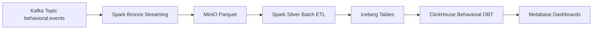

# Behavioral Gold Design and Project Flow

## Purpose

This document explains the core concepts used in the project, how data flows through Bronze and Silver, how the project schema is organized, and how the Behavioral Gold layer should be implemented on top of Silver.

The focus of Gold in this repository is the Behavioral domain only.

## Core Concepts

### Medallion architecture

The project follows a medallion layout:

- Bronze: raw ingestion from Kafka into durable object storage
- Silver: validated, cleaned, and modeled data in Iceberg
- Gold: denormalized analytics tables in ClickHouse

Each layer has a different contract:

- Bronze preserves source fidelity
- Silver enforces quality and modeling rules
- Gold optimizes query speed for dashboards and OLAP

### Kafka

Kafka is the source event bus for behavioral events. Behavioral Bronze consumes the topic defined in [`src/schemas/bronze_behavioral_schemas.py`](../src/schemas/bronze_behavioral_schemas.py).

### Spark Structured Streaming

Bronze ingestion uses Spark streaming to read Kafka micro-batches, cast and normalize fields, and write partitioned Parquet files to MinIO.

### Schema Registry

The behavioral Bronze topic is driven by Schema Registry. The project keeps only metadata and required field contracts in code, not a copied Avro schema.

### MinIO

MinIO provides object storage for Bronze output, Silver warehouse data, and checkpoints.

### Iceberg

Silver uses Apache Iceberg to store ACID tables on MinIO. This gives the Behavioral pipeline versioned tables, safer merges, and a stable analytical contract.

### ClickHouse

Gold uses ClickHouse as the OLAP serving layer. The Behavioral Gold table should be a wide, denormalized One Big Table optimized for fast aggregations.

### Airflow

Airflow orchestrates scheduled batch jobs. In this project, Airflow checks upstream availability and then runs the Spark job for the layer.

### Deterministic keys

Silver and Gold use deterministic surrogate keys and natural key hashes so the same business entity maps to the same analytical identity across runs.

## Project Schema Map

### Bronze Behavioral

Bronze behavioral contracts live in:

- [`src/schemas/bronze_behavioral_schemas.py`](../src/schemas/bronze_behavioral_schemas.py)
- [`src/common/bronze_behavioral_kafka_reader.py`](../src/common/bronze_behavioral_kafka_reader.py)
- [`src/common/bronze_behavioral_transform.py`](../src/common/bronze_behavioral_transform.py)
- [`src/common/bronze_behavioral_minio_writer.py`](../src/common/bronze_behavioral_minio_writer.py)
- [`src/jobs/bronze_behavioral_job.py`](../src/jobs/bronze_behavioral_job.py)

Bronze behavioral input fields include the core event envelope:

- `event_id`
- `timestamp`
- `user_id`
- `event_type`
- `device_type`
- `session_id`

and optional behavioral attributes such as:

- `ip_address`
- `utm_source`
- `product_id`
- `quantity`
- `cart_items`
- `cart_value`
- `shipping_method`
- `order_id`
- `fulfillment_speed`
- `url_path`
- `duration_sec`
- `http_status`
- `payment_type`
- `success`
- `error_code`
- `query`
- `results_count`
- `clicked_position`
- `rating`
- `text_length`
- `wishlist_name`

### Silver Behavioral

Silver behavioral logic lives in:

- [`src/common/silver_behavioral_bronze_reader.py`](../src/common/silver_behavioral_bronze_reader.py)
- [`src/common/silver_behavioral_cleaning.py`](../src/common/silver_behavioral_cleaning.py)
- [`src/common/silver_behavioral_config.py`](../src/common/silver_behavioral_config.py)
- [`src/common/silver_behavioral_schema.py`](../src/common/silver_behavioral_schema.py)
- [`src/common/silver_behavioral_transform.py`](../src/common/silver_behavioral_transform.py)
- [`src/common/silver_behavioral_validation.py`](../src/common/silver_behavioral_validation.py)
- [`src/jobs/silver_behavioral_job.py`](../src/jobs/silver_behavioral_job.py)
- [`workflow/dags/silver_behavioral_dag.py`](../workflow/dags/silver_behavioral_dag.py)

Silver behavioral produces these core Iceberg tables:

- `dim_behavioral_device`
- `dim_behavioral_event_type`
- `dim_behavioral_session`
- `fact_behavioral_events`
- `behavioral_events_quarantine`
- `behavioral_pipeline_state`
- `behavioral_validation_issues`

### Gold Behavioral

Gold behavioral is planned to live in:

- `src/gold/`
- `sql/clickhouse/`
- `workflow/dags/`

Gold should load from Silver Iceberg tables and publish a single ClickHouse OBT for BI tools.

## Behavioral Data Flow

## Bronze Layer Flow

Bronze is the ingestion and preservation layer.

### Input

Behavioral events arrive from Kafka.

### Processing

The Bronze pipeline:

- reads Kafka micro-batches with Spark
- validates the source schema contract
- casts fields into the expected types
- normalizes timestamps
- writes compressed Parquet to MinIO
- stores offsets and progress with checkpoints

### Output

Bronze output is raw but queryable history in object storage. The output is not yet business modeled.

## Silver Layer Flow

Silver is the quality and modeling layer.

### Input

Silver reads the Bronze Parquet partitions for a given execution date.

### Processing

The Silver Behavioral job:

- checks that the Bronze partition exists
- reads the Bronze partition into Spark
- validates records and splits rejected rows into quarantine
- cleans and standardizes values
- generates deterministic dimension keys
- builds Iceberg dimensions and fact tables
- writes pipeline state and quality outputs

### Output

Silver exposes a stable analytical model:

- dimensions for device, event type, and session
- a fact table for event grain
- quarantine and quality tables for observability

This layer is the source of truth for Gold.

## Behavioral Gold Design

Gold should flatten Silver into a single query-friendly table.

### Gold grain

One row per behavioral event.

### Gold source tables

The Gold loader should primarily read:

- `fact_behavioral_events`
- `dim_behavioral_device`
- `dim_behavioral_event_type`
- `dim_behavioral_session`

If a shared user dimension is available, it can enrich the Gold table, but Gold should not depend on it being present.

### Proposed Gold table

Recommended table name:

- `behavioral_obt`

### Gold column groups

#### Event identity

- `event_key`
- `event_id`
- `event_identity_source`
- `pipeline_run_id`

#### Time and partitioning

- `event_timestamp`
- `date_key`
- `processing_date`
- `bronze_ingestion_timestamp`
- `silver_ingestion_timestamp`
- `kafka_timestamp`

#### User and session context

- `user_key`
- `user_id`
- `session_key`
- `session_id`
- `session_start_at`
- `session_end_at`
- `session_duration_sec`
- `event_count`

#### Device and event metadata

- `device_key`
- `device_name`
- `event_type_key`
- `event_type`
- `event_category`
- `primary_device_key`

#### Behavioral and commerce attributes

- `utm_source`
- `ip_address_hash`
- `product_id`
- `order_id`
- `url_path`
- `query`
- `wishlist_name`
- `payment_type`
- `shipping_method`
- `fulfillment_speed`
- `error_code`
- `success`
- `http_status`
- `quantity`
- `cart_total_items`
- `cart_value`
- `duration_sec`
- `results_count`
- `clicked_position`
- `rating`
- `text_length`
- `cart_items`
- `dq_flags`

#### Lineage and operational fields

- `kafka_topic`
- `kafka_partition`
- `kafka_offset`
- `source_file`

### Physical design

Recommended ClickHouse design:

- database: `lakehouse`
- table engine: `ReplacingMergeTree`
- version column: `silver_ingestion_timestamp`
- partition key: month of `event_timestamp`
- sort key: `date_key, event_category, event_type, user_key, session_key, event_key`

This design supports:

- time-based pruning
- fast category and event-type filtering
- efficient user and session lookups
- safe reprocessing with idempotent loads

### Gold loading behavior

The Gold loader should:

- read the latest Silver partitions for a requested date or run window
- join the fact table with dimensions
- build the wide OBT row
- validate required keys and row counts
- write into ClickHouse in an idempotent way

### Recommended Gold implementation units

- `src/gold/behavioral_gold_transform.py`
  - joins Iceberg inputs into the final OBT dataframe
- `src/gold/behavioral_gold_loader.py`
  - handles ClickHouse connection and inserts
- `src/jobs/gold_behavioral_job.py`
  - command-line entry point for batch runs
- `sql/clickhouse/behavioral_gold_ddl.sql`
  - creates database and table
- `workflow/dags/gold_behavioral_dag.py`
  - orchestrates the scheduled load

## Implementation Plan

1. Define the Gold schema and ClickHouse DDL.
2. Implement the Spark transform that flattens Silver into the Gold OBT.
3. Add the ClickHouse writer and idempotent load strategy.
4. Create the Airflow DAG for daily or interval-based loading.
5. Add validation checks for schema, counts, and freshness.
6. Document dashboard-ready queries in `sql/metabase/` if needed.

## Operational Notes

- Gold should not mutate Bronze or Silver tables.
- Gold should be reproducible from Silver at any time.
- Reprocessing a date should not create duplicate analytical rows.
- Behavioral Gold should remain independent from Transactional Gold until a shared model is explicitly introduced.

## Summary

Bronze captures raw behavioral events from Kafka. Silver validates and models them in Iceberg. Gold flattens that modeled data into ClickHouse so Metabase can query it quickly without heavy joins.

The next step is to implement the Behavioral Gold code and DDL based on this contract.
